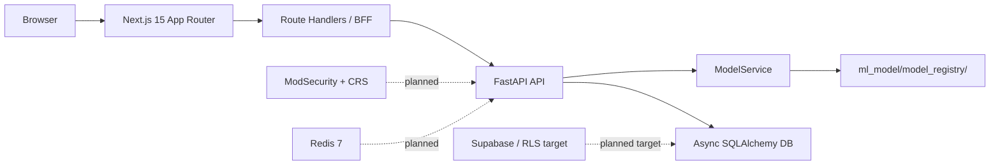

# Architecture

Last updated: 2026-03-15

This document describes the current repository architecture. It distinguishes between what is implemented now and what remains planned.

## Current Topology



## Backend

### Layering

The backend follows the intended Clean Architecture split:

- `web_app/domain/`
  - Domain contracts and entities
- `web_app/application/`
  - Use cases such as triage and feedback
- `web_app/infrastructure/`
  - Database setup and repository implementations
- `web_app/presentation/`
  - FastAPI app factory, route handlers, and request/response schemas

This aligns with FastAPI's own guidance for larger applications: split routers and dependencies into separate modules and compose them in the main app.

### Runtime entrypoint

- App factory: `web_app.presentation.app:create_app`
- Lifespan startup initializes the database and loads `ModelService`

### Current routes

- Protected by backend bearer auth:
  - `POST /api/predict`
  - `POST /api/triage`
  - `GET /api/alerts`
  - `GET /api/alerts/{id}`
  - `GET /api/stats`
  - `GET /api/ml-health`
- Public backend endpoints:
  - `POST /api/feedback`
  - `GET /health`
  - `GET /api/health`

### Model loading behavior

- `web_app/services/model_service.py` is the runtime model boundary.
- In production mode, `MODEL_REGISTRY_PATH` must point to an explicit model run directory.
- In development and testing, the service can resolve the latest staged run from a broader directory, or fall back to a mock service if the configured path does not exist.
- The active model artifact tree is under `ml_model/model_registry/`.

## Frontend

### App structure

- Framework: Next.js 15 App Router
- Auth: Auth.js credentials provider with JWT sessions
- Data layer: TanStack Query + Zod
- Client state: Zustand

### Security boundary

The intended boundary is:

```text
Browser -> Next.js Route Handler -> FastAPI
```

This remains the correct direction for the project. Browser-to-FastAPI direct calls are not part of the intended architecture.

Next.js route handlers remain the browser-facing boundary, but the implemented handlers are not anonymous: the dashboard BFF handlers call `auth()` and return `401` without a valid session. They are still the right place to proxy or reshape backend data for the dashboard.

### Current BFF status

- `frontend/lib/bff-client.ts` is the shared server-only BFF client.
- `frontend/app/api/alerts/route.ts`, `frontend/app/api/alerts/[id]/route.ts`, `frontend/app/api/stats/route.ts`, and `frontend/app/api/ml-health/route.ts` call FastAPI in non-mock mode.
- Those four handlers all require a valid Auth.js session via `auth()`.
- `USE_MOCK_API` is the single centralized server-only mock toggle for those handlers.
- The BFF validates transport payloads with Zod and preserves backend-emitted `action_taken` values: `BLOCKED`, `THROTTLED`, `ALLOWED`.

## Data and Persistence

### Current database reality

- Async SQLAlchemy is the persistence layer today
- The ORM model is `TrafficLog`
- Fields currently include:
  - transaction metadata
  - request metadata
  - prediction and confidence
  - inference latency
  - analyst feedback metadata

### Current environment reality

- Tests use SQLite
- Development can use SQLite or PostgreSQL
- Supabase is still the production target, not the fully wired default implementation in this repo

## ML Artifacts and Training Config

- Staged artifacts live under `ml_model/model_registry/staging/`
- Evaluation outputs live under `ml_model/model_registry/eval/`
- Model configs live under `config/models/`
- Current runtime defaults align with the DistilBERT staging path and the locked confidence thresholds

## What Is Planned, Not Implemented

- Docker Compose based 3-container stack
- Runnable ModSecurity + OWASP CRS bridge
- Redis-backed IP blocklist, rate-limit state, and low-confidence queue
- Full Supabase append-only audit log enforcement with RLS

## Current limitations

- `PROCESSING` placeholder rows are hidden from normal alerts and stats reads, but stale reservations are only surfaced with `503` and `Retry-After`; there is no auto-reclaim path yet.
- `app.state.model` remains as a compatibility alias for `app.state.model_service`.
- `ModelService.predict()` still returns compatibility aliases such as `class` and `confidence_level` alongside the canonical `prediction` and `confidence_tier` fields.
- The dashboard still relies on BFF-derived display fields for some stats and ML-health cards because the backend payloads intentionally stay narrower than the frontend contract.

## Architecture Notes For Future Edits

- Do not document planned infrastructure as shipped behavior.
- Keep the live path names exact. Runtime artifacts live under `ml_model/model_registry/`.
- Keep setup docs and architecture docs synchronized with the route handlers and tests, not with older planning files.
