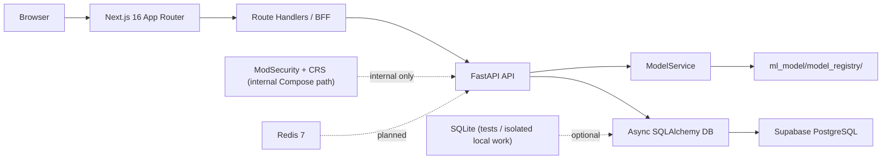

# Architecture

Last updated: 2026-03-24

This document describes the current repository architecture. It distinguishes between what is implemented now and what remains planned.

## Current Topology



## Backend

### Layering

The backend follows the intended Clean Architecture split:

- `web_app/domain/`
  - Domain contracts and entities
- `web_app/application/`
  - Use cases such as triage and feedback
- `web_app/infrastructure/`
  - Database setup and repository implementations
- `web_app/presentation/`
  - FastAPI app factory, route handlers, and request/response schemas

### Runtime entrypoint

- App factory: `web_app.presentation.app:create_app`
- Lifespan startup initializes the database and loads `ModelService`

### Current routes (2026-03-23)

- Protected by backend bearer auth:
  - `POST /api/predict`
  - `POST /api/triage`
  - `POST /api/internal/waf-events`
  - `GET /api/alerts`
  - `GET /api/alerts/{id}`
  - `PATCH /api/alerts/{id}/triage`
  - `GET /api/stats`
  - `GET /api/ml-health`
- Public backend endpoints:
  - `POST /api/feedback`
  - `GET /health`
  - `GET /api/health`

### Model loading behavior

- `web_app/services/model_service.py` is the runtime model boundary.
- In production mode, `MODEL_REGISTRY_PATH` must point to an explicit model run directory.
- In development and testing, the service can resolve the latest staged run from a broader directory, or fall back to a mock service if the configured path does not exist.
- The active model artifact tree is under `ml_model/model_registry/`.

## Frontend

### App structure

- Framework: Next.js 16 App Router
- Auth: Auth.js credentials provider with JWT sessions
- Data layer: TanStack Query + Zod
- Client state: Zustand

### Security boundary

The intended boundary is:

```text
Browser -> Next.js Route Handler -> FastAPI
```

This remains the correct direction for the project. Browser-to-FastAPI direct calls are not part of the intended architecture.

### WAF ingest data-plane (phase 1)

The repository now includes a separate SOC-oriented ingest lane for WAF-derived suspicious traffic evidence:

```text
ModSecurity audit event -> waf_audit_bridge.py -> POST /api/internal/waf-events -> WafIngestUseCase/TriageUseCase -> traffic_logs -> Next.js BFF dashboard views
```

This lane is detect-and-forward only in this phase. It does not make ModSecurity the browser-facing UI boundary and it does not implement live network enforcement.

Next.js route handlers remain the browser-facing boundary, but the implemented handlers are not anonymous: the dashboard BFF handlers call `auth()` and return `401` without a valid session. They are still the right place to proxy or reshape backend data for the dashboard.

### Current BFF status (2026-03-23)

- `frontend/lib/bff-client.ts` is the shared server-only BFF client.
- All five route handlers wired:
  - `frontend/app/api/alerts/route.ts` (GET list)
  - `frontend/app/api/alerts/[id]/route.ts` (GET detail)
  - `frontend/app/api/alerts/[id]/triage/route.ts` (PATCH triage)
  - `frontend/app/api/stats/route.ts`
  - `frontend/app/api/ml-health/route.ts`
- Those five handlers all require a valid Auth.js session via `auth()`.
- `USE_MOCK_API` is the single centralized server-only mock toggle (currently **false**).
- The BFF validates transport payloads with Zod and preserves backend-emitted `action_taken` values: `BLOCKED`, `THROTTLED`, `ALLOWED`.
- Alert payload normalization now carries optional WAF evidence metadata (`ingest_source`, `matched_rule_messages`, `matched_rule_tags`) without breaking older payloads.
- `frontend/proxy.ts` is the active edge entrypoint for protected dashboard routes.

## Data and Persistence

### Current database reality

- Async SQLAlchemy is the persistence layer today
- The ORM model is `TrafficLog`
- Tests use SQLite
- Isolated local work can still use SQLite when needed
- The current app runtime is wired to Supabase-backed PostgreSQL
- Some Supabase policy and operational guardrails still live outside repo automation

## ML Artifacts and Training Config

- Staged artifacts live under `ml_model/model_registry/staging/`
- Evaluation outputs live under `ml_model/model_registry/eval/`
- Model configs live under `config/models/`
- Current runtime defaults align with the DistilBERT staging path and the locked confidence thresholds

## What Is Present But Not Yet The Primary Runtime Path

- A local `docker-compose.yml`
- Backend and frontend Dockerfiles
- An internal Compose ModSecurity + OWASP CRS bridge to the backend

## What Is Planned, Not Implemented

- ModSecurity as the browser-facing runtime boundary
- Redis-backed IP blocklist, rate-limit state, and low-confidence queue
- Full repo-managed export and automation of Supabase policy state

## Current limitations

- `PROCESSING` placeholder rows are hidden from normal alerts and stats reads. Expired leases are automatically reclaimed via the `lease_expires_at` field when a later request finds the lease stale.
- `ModelService.predict()` still returns compatibility aliases such as `class` and `confidence_level` alongside the canonical `prediction` and `confidence_tier` fields.
- The dashboard still relies on BFF-derived display fields for some stats and ML-health cards because the backend payloads intentionally stay narrower than the frontend contract.

## Architecture Notes For Future Edits

- Do not document planned infrastructure as shipped behavior.
- Keep the live path names exact. Runtime artifacts live under `ml_model/model_registry/`.
- Keep setup docs and architecture docs synchronized with the route handlers and tests, not with older planning files.
- Test baseline: pytest 264 passed, vitest 122 passed, typecheck passed, lint passed, build passed.
