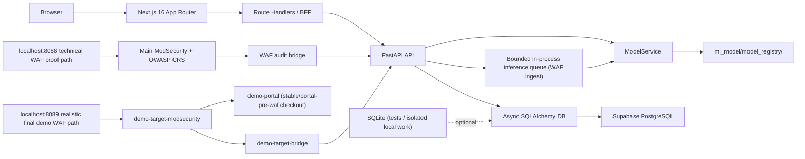

# Architecture

This document describes the current repository architecture. It distinguishes between what is implemented now and what remains planned.

Client-stated security and alerting requirements are tracked in `docs/client-requirements.md`. They are architectural drivers for planned account security and alerting work, but not all are implemented in the current repository state.

## Current Topology



## Feature State Matrix

| Feature | Current State | Evidence |
|---|---|---|
| Browser dashboard path | Implemented | `frontend/app/api/*`, `frontend/proxy.ts`, `frontend/lib/bff-client.ts` |
| FastAPI routes and BFF calls | Implemented | `web_app/presentation/api/routes.py`, `frontend/app/api/*` |
| ModelService runtime boundary | Implemented | `web_app/services/model_service.py` |
| WAF ingest endpoint | Implemented; historical local proof | POST uses the distinct WAF bearer dependency, GET lookup retains the internal bearer dependency; current route tests `17 passed` including Telegram enqueue failure isolation |
| WAF JSONL bridge | Implemented; historical local proof | bridge uses `WAF_INGEST_API_KEY`, canonical source evidence, and explicit provenance mode; current bridge tests `53 passed` |
| Trusted source correlation | Implemented; hosted identity verification Partial | canonical IP/provenance/status, factual SHA-256 fingerprint, immutable duplicate handling, atomic matching stale reclaim, migration `20260715_000021`, isolated Compose profiles, and operator home/mobile source correlation are complete; final Cloudflare/origin trust gates remain, so mode stays `unverified` |
| ModSecurity request path | Verified local proof | `localhost:8088` is the technical CyberTrace backend WAF proof path; SQLi blocks with HTTP 403 and writes `logs/modsecurity/modsec_audit.jsonl` |
| Demo-target WAF ingest path | Verified local PD2 proof | `localhost:8089` is the realistic protected demo website path; `demo-target-bridge` forwards separate `logs/modsecurity/demo-target/modsec_audit.jsonl` events; transaction `178249138618.813428` reached FastAPI as `/records/search`, `SQL Injection`, `BLOCKED`, `crs_score=15` |
| Backend Compose exposure | Implemented | backend is internal-only in Compose and shown as `8000/tcp`; proof lookup uses `docker compose exec`, not `localhost:8000` |
| Inference queue | Implemented | `web_app/application/inference_queue.py`; targeted tests cover synchronous WAF ingest, queue overflow, and queue health |
| Request/trace context | Implemented | request middleware preserves or generates safe IDs, returns `X-Request-ID` on handled and generic unhandled `500` responses, and preserves valid W3C version-00 `traceparent` IDs |
| Structured observability logs | Implemented | request/WAF/prediction boundaries and bridge operational/configuration events emit JSON; recursive variant-aware redaction and correlation behavior are covered by targeted tests |
| Real-time dashboard alerts | Implemented and manually verified in the tested hosted deployment | post-commit in-process broadcaster -> native FastAPI SSE -> authenticated Next.js streaming BFF -> one dashboard EventSource -> TanStack Query alert/stats invalidation; no-refresh, browser reconnect, and named-domain hosted SSE proof passed; no durable replay or multi-worker fan-out |
| Notification outbox and worker | Implemented locally; current provider evidence is tracked in `STATUS.md` | notification schema/workflow introduced through `20260720_000022`; current repository migration head is `20260905_000029`; versioned PostgreSQL claim/transition functions, protected email credential payloads, deadline/cancellation/terminal scrubbing, batch-one worker, Resend delivery, and Telegram `sendMessage` delivery for persisted in-scope HIGH/CRITICAL alerts |
| RBAC secure login | Implemented | Auth.js Credentials login reads `auth_accounts`; the `OWNER`/`ADMIN`/`ANALYST`/`VIEWER` role claim and `authz_version` are rechecked against the current DB row by all protected BFF routes; centralized permissions make ML Health and ML Deployment Owner-only |
| Auth/security schema foundation | Implemented | additive Alembic migration creates public-schema auth/security tables with RLS, explicit public-role revocations, and no policies; `frontend/lib/server/db/` contains the server-only service-role boundary |
| Argon2id, account provisioning, and login cutover | Implemented in repo | runtime accepts only approved Argon2id PHC parameters, unknown-account timing uses a precomputed same-profile hash, scripts load `frontend/.env.local` with shell precedence, and app runtime login uses the server-only Supabase boundary |
| 2FA/MFA | Implemented and verified behind server-side availability flags | encrypted TOTP enrollment, replay-safe completion, backup/email recovery, and mandatory re-enrollment routes are implemented; the hosted Admin journey is verified |
| `CRITICAL >=90%` confidence tier | Implemented | current contracts expose LOW/MEDIUM/HIGH/CRITICAL with legacy severity compatibility |
| Runtime enforcement | PR5 LOW/MEDIUM and PR6 HIGH implemented and controlled locally E2E-validated; PR7 Block 1 and Block 2 controlled-local WAF runtime implemented and E2E-validated; hosted disabled | PR4 `SHADOW` rows remain historical and non-disruptive. Explicit `ENFORCE`/`confidence-enforcement-v2` rows use the existing expiring recommendation store; LOW/MEDIUM retain PostgreSQL fixed-window counters and tier-bound server-verified challenge grants. `/api/internal/enforcement/check` returns exact `ALLOW`, `CHALLENGE`, `THROTTLE`, or `BLOCK` decisions only for `/records/search`. A valid applicable HIGH recommendation has precedence over MEDIUM/LOW and produces `BLOCK`. PR7 adds durable revisioned effective WAF state, an authenticated snapshot boundary, deterministic candidate rendering, reload/generation confirmation, candidate-specific probing, and rollback. The controlled PostgreSQL-to-backend-to-WAF path passes; Block 3 still owns full attack-to-ML creation, external ingress/source identity, PR6/PR7 integrated regression, and portal no-upstream evidence. Hosted active enforcement remains disabled. |
| Verified label review workflow | Implemented locally; export and retraining lifecycle implemented in controlled local mode | Analysts and admins append immutable reviews through the authenticated Next.js BFF and internal FastAPI route. Alert responses project only the latest revision. Only `approved_for_training` enters the retraining snapshot. The Owner-only ML Deployment control plane, worker lifecycle, evidence gates, explicit local staging promotion, rollback, and scheduled trigger are implemented; hosted/production promotion remains disabled and unverified. |
| Training/evaluation source organization | Implemented for controlled-local execution | Canonical benchmark helpers and script-first entrypoints live under `ml_model/training/`, `ml_model/preprocessing/`, and `ml_model/evaluation/`; the dashboard native adapter reuses those entrypoints rather than duplicating a training loop. Native laptop quality proof remains separate evidence. |
| Retraining pipeline | Implemented controlled-local lifecycle; hosted/production NOT_RUN | Reviewed-sample export, cumulative snapshots, durable worker runs, evidence-gated decisions, explicit local staging promotion/rollback, and a bounded scheduled trigger are implemented. Native model-quality execution, installed scheduling, hosted promotion, and production registry writes remain separate evidence. |
| Wazuh export | Planned | no Wazuh JSON/JSONL export implementation found |
| Full Wazuh/SIEM, Kubernetes, Kafka/Celery/Elasticsearch | Deferred | PD2 scope keeps these out unless explicitly approved |

## Backend

### Layering

The backend follows the intended Clean Architecture split:

- `web_app/domain/`
  - Domain contracts and entities
- `web_app/application/`
  - Use cases such as triage and feedback
- `web_app/infrastructure/`
  - Database setup and repository implementations
- `web_app/presentation/`
  - FastAPI app factory, route handlers, and request/response schemas

### Runtime entrypoint

- App factory: `web_app.presentation.app:create_app`
- Lifespan startup initializes the database, loads `ModelService`, and starts
  the bounded in-process inference queue used by WAF ingest.

### API surface

FastAPI exposes protected application APIs, internal WAF ingest and lookup
boundaries, public health checks, and the authenticated alert stream. Exact
methods and paths are maintained by route tests and the generated OpenAPI
surface; this document describes boundaries rather than duplicating a complete
route reference.

### Model loading behavior

- `web_app/services/model_service.py` is the runtime model boundary.
- In production mode, `MODEL_REGISTRY_PATH` must point to an explicit model run directory.
- In development and testing, the service can resolve the latest staged run from a broader directory, or fall back to a mock service if the configured path does not exist.
- The active model artifact tree is under `ml_model/model_registry/`.

### Classification scope and operational alert boundary

The classifier vocabulary is broader than the product's operational security
scope. `web_app/domain/classification_scope.py` is the single fail-closed
policy: only `SQL Injection` and `Code Injection` are actionable attack
classes; `Normal` is benign; `Other Attacks` and any unknown future label are
out of operational scope.

`WafIngestUseCase` and the legacy triage route still preprocess, infer, and
persist every completed classification in the `TrafficLog` evidence row. The
row preserves the original prediction, confidence, model input/provenance,
request metadata, timestamps, and model version. This repository has no
separate alert table: an operational alert is the in-scope projection of that
row. The triage result exposes an alert id and publishes the post-commit alert
signal only for the positive allowlist, and the WAF route then runs
enforcement/action recommendations and notification enqueueing only for that
result.

The same policy is applied in the repository boundary for alert list/detail,
statistics, activity buckets, recent operational traffic, triage/action
updates, enforcement recommendation lookups, and direct threat notification
helpers. Consequently, historical `Other Attacks` rows remain available to
raw/internal review, drift, model-health, and retraining/evaluation paths but
cannot contribute to current operational alert views, dashboard attack
aggregates, Alert Summary/detail, realtime alert invalidation, Telegram/email
threat jobs, or enforcement actions. No schema migration or duplicated scope
column is required because the decision is derived from the persisted label.

## Frontend

### App structure

- Framework: Next.js 16 App Router
- Auth: Auth.js credentials provider with JWT sessions
- Data layer: TanStack Query + Zod
- Client state: Zustand

### Client-Required Account Security

The current Auth.js credentials flow is the named-account foundation. Client requirements still call for:

- secure login backed by real user access management,
- RBAC for role-specific access such as Owner, Admin, and Analyst,
- strong account security controls,
- 2FA.

Implemented in the current foundation:

- Supabase `auth_accounts` with Argon2id password hashes,
- `OWNER`/`ADMIN`/`ANALYST`/`VIEWER` session claims and an explicit role hierarchy,
- current DB account, disablement, role, and `authz_version` freshness checks in BFF route guards,
- current `mfa_required` fail-closed checks in login and every protected BFF route,
- local login hardening with generic errors, dummy verification, throttles, and JSON audit events.
- a centralized role-to-permission policy: Owner has the complete permission set, while ML Health and ML Deployment permissions are absent from Admin and lower roles,
- alerts UI role affordances in the dashboard: viewers are read-only, analysts keep triage controls, and admins keep the full alert/account control set.

MFA and password recovery extend the existing Auth.js boundary with server-only Supabase RPCs, encrypted TOTP material, replay-safe challenges, trusted database verification timestamps, factor-aware enrollment, purpose-bound completion contracts, recent-TOTP step-up, and scanner-safe POST routes. Availability flags fail closed when absent and are evaluated at request time by `frontend/lib/server/runtime-config.ts`, which calls Next.js `connection()` before reading runtime environment values.

### Auth.js session and MFA transition

- Owner- or Admin-managed account creation emits a one-time setup link; the setup token is consumed server-side to establish the password without exposing credentials to the browser or logs.
- Credential authentication creates a password-level Auth.js session containing the account identity and current authorization metadata.
- Accounts requiring MFA receive a short-lived, purpose-bound pre-auth challenge and an HttpOnly pre-auth handle; password-level sessions cannot reach protected dashboard or User Management routes.
- Successful TOTP enrollment or verification completes the database challenge and transitions the browser to the MFA-authenticated session state. The pre-auth handle is cleared as part of the completion flow.
- The route guard reloads the active account and validates disablement, role, `mfa_required`, `authz_version`, `auth_level`, `auth_method`, and permissions before protected work.
- Recovery sessions carry separate assurance and are routed through the existing mandatory enrollment/recovery behavior; recovery is not treated as TOTP assurance.

CyberTrace currently pins `next-auth` `5.0.0-beta.30`. The dependency is protected by unit, integration, and authentication E2E tests. Auth.js upgrades must be performed in a separate PR and must rerun the complete authentication test suite.

### Security boundary

The intended boundary is:

```text
Browser -> Next.js Route Handler -> FastAPI
```

This remains the correct direction for the project. Browser-to-FastAPI direct calls are not part of the intended architecture.

Next.js route handlers remain the browser-facing boundary, but the implemented handlers are not anonymous: the dashboard BFF handlers call `auth()` and return `401` without a valid session. They are still the right place to proxy or reshape backend data for the dashboard.

### Current BFF status

- `frontend/lib/bff-client.ts` is the shared server-only BFF client.
- Protected dashboard route handlers wired:
  - `frontend/app/api/alerts/route.ts` (GET list)
  - `frontend/app/api/alerts/stream/route.ts` (GET SSE stream)
  - `frontend/app/api/alerts/[id]/route.ts` (GET detail)
  - `frontend/app/api/alerts/[id]/triage/route.ts` (PATCH triage)
  - `frontend/app/api/alerts/[id]/label-review/route.ts` (POST verified label review)
  - `frontend/app/api/alerts/[id]/action/route.ts` (PATCH action)
  - `frontend/app/api/stats/route.ts`
  - `frontend/app/api/ml-health/route.ts`
  - `frontend/app/api/ml-model/summary/route.ts`, `/export`, and `/runs/*`
- Every protected handler requires a valid Auth.js session and an awaited DB-backed `requirePermission()` check before downstream work. ML Health and every ML Deployment BFF route require Owner-only permissions; the BFF forwards the validated session actor to FastAPI for a second authorization check.
- `USE_MOCK_API` is the single centralized server-only mock toggle (currently **false**).
- The BFF validates transport payloads with Zod and preserves backend-emitted `action_taken` values: `BLOCKED`, `THROTTLED`, `ALLOWED`.
- `frontend/app/api/alerts/[id]/label-review/route.ts` accepts the four-class
  verified-label vocabulary and review states after the server derives reviewer
  identity and role from the current session. The browser cannot submit an
  email address or reviewer identity.
- The BFF proxies that request to internal FastAPI
  `POST /api/alerts/{alert_id}/label-review`. Label review state is separate
  from triage `action_taken` and is not an enforcement decision.
- The alerts table and alert drawer now hide unavailable dense-row mutation controls for viewers and preserve triage/action control visibility according to the current role.
- `frontend/proxy.ts` is the active edge entrypoint for protected dashboard routes, including `/ml-model`.

### Real-time alert synchronization

SSE is a notification channel, not a second alert-data contract. After a new
alert is committed and becomes visible, `TriageUseCase` publishes the minimal
named event `alert.created` with `{"changed": true}`. The authenticated BFF
streams it to the browser without exposing `API_SECRET_KEY`; `AlertStreamSync`
coalesces bursts for 200 ms and invalidates the existing alerts and stats query
families. Initial connection and native EventSource reconnection both emit
`open`, which triggers the same canonical REST refetch and recovers alerts
created while disconnected.

Each backend stream ends after five minutes. Native EventSource reconnection
therefore re-enters the authenticated BFF and re-runs current account and RBAC
checks. The BFF limits upstream connection establishment to ten seconds,
rejects redirects and non-exact SSE media types, returns generic upstream
errors, and emits private/no-store, no-transform, no-buffer, and nosniff
response controls. Post-commit publisher failure is warning-only because it
must not change the result of an already-successful database write.

The broadcaster uses one bounded queue per subscriber (`maxsize=1`), so slow
clients cannot block ingest and repeated unread signals coalesce. It is
in-process only: a future multi-worker/multi-instance runtime would need shared
fan-out such as PostgreSQL `LISTEN/NOTIFY` or Redis, neither of which is
implemented here. There is no durable replay log or `Last-Event-ID` recovery.

### Runtime configuration and authorization

Runtime authentication feature flags are availability controls only; they never
count as authentication or authorization. Page-level readers call
`readPageRuntimeAuthFlags()` before reading `process.env`, and already-dynamic
server code can use `readRuntimeAuthFlags()`. Authorization remains server-side
through Auth.js session validation, active-account lookup, freshness checks, MFA
assurance checks, and RBAC permission checks. Generic not-found responses remain
the client-facing behavior for disabled or unauthorized pages.

## Data and Persistence

### Current database reality

- Async SQLAlchemy is the persistence layer today
- The ORM model is `TrafficLog`
- Tests use SQLite
- Isolated local work can still use SQLite when needed
- The current app runtime is wired to Supabase-backed PostgreSQL
- Repository Alembic head: `20260905_000029`. Latest hosted Supabase revision with recorded evidence: `20260712_000020`.
- The auth/security schema foundation and app-runtime account lookup are implemented additively; `auth_accounts` is now the login and request-time session-freshness source of truth
- MFA/recovery state transitions are database-authoritative. Auth.js receives only typed completion claims returned by purpose-bound PostgreSQL functions.
- Notification outbox rows have bounded deadlines, cancellation/expiry/permanent-failure terminal states, and lease reconciliation. Email retains AES-GCM protection for active credential-equivalent payloads; Telegram is database-restricted to safe `threat_detected` payloads. Terminal payloads are scrubbed.
- New auth/security tables use the current `public` schema convention with RLS and no anon/authenticated policies. RLS is defense-in-depth only because service-role access bypasses it; server-only credential isolation is the actual boundary
- `AUTH_USERS_JSON` is not read by runtime auth. Supabase query or configuration failure denies login and protected BFF access without an env fallback

### Verified label reviews

`traffic_label_reviews` is an append-only audit table. Each review locks the
parent traffic row, assigns the next per-alert revision, and records the
predicted label, verified label, approval state, reviewer id/role, model
version, input hash, optional note, and timestamps. There is no update or
delete repository operation. Alert list/detail projections join the maximum
revision back to the review table, so the API exposes the latest review while
preserving the full history for the run-local reviewed-sample exporter.

The canonical verified-label vocabulary is `SQL Injection`, `Code Injection`,
`Other Attacks`, and `Normal`. It is intentionally distinct from confidence
tiers and triage transport states (`BLOCKED`, `THROTTLED`, `ALLOWED`). The
exporter selects only rows whose latest review is
`approved_for_training`; `excluded_from_training` is never an export approval.
The exporter, worker orchestration, evidence-gated review, explicit controlled-
local staging promotion, rollback, and bounded scheduler trigger are
implemented. The scheduler cannot approve or deploy. Hosted/production
promotion, installed scheduling, native model-quality execution, and
production model writes are not implemented or verified.
The legacy response field `input_hash`, when present, is an ingest-event hash
kept for compatibility; new exporter code must use `model_input_hash` and
`model_input_text` instead.
- `frontend/lib/server/db/client.ts` remains the `server-only` app-runtime boundary, while `script-client.mjs` is restricted to operational provisioning scripts
- Some Supabase policy and operational guardrails still live outside repo automation

## ML Artifacts and Training Config

- Staged artifacts live under `ml_model/model_registry/staging/`
- Evaluation outputs live under `ml_model/model_registry/eval/`
- Model configs live under `config/models/`
- Current runtime defaults align with the DistilBERT staging path and the locked confidence thresholds

## What Is Present But Not Yet The Primary Runtime Path

- A local `docker-compose.yml`
- Backend and frontend Dockerfiles
- A verified historical local Compose ModSecurity + OWASP CRS proof path through `localhost:8088`; the pair now requires the `technical-waf` profile
- A demo-target WAF profile through `localhost:8089`; the profile is optional for normal developer startup, but required for the final realistic WAF demonstration. It builds `demo-portal` from a separate checkout of this repository's `stable/portal-pre-waf` branch, runs it as an internal Compose service on port `3010`, and does not publish portal port `3010` to the host by default.
- Internal WAF event ingest route and JSONL bridge tooling

## Known architectural gaps

See [`IMPLEMENTATION_GAP_REGISTER.md`](project-ops/IMPLEMENTATION_GAP_REGISTER.md)
for the canonical backlog. Runbooks and policies are implemented; automation
and hosted deployment gates remain separately tracked there.

### HIGH versus CRITICAL enforcement boundary

- **HIGH / PR6:** application-level enforcement. The request reaches the Land
  Records portal, which consults CyberTrace before protected record-search work;
  a valid `APPLICATION_BLOCK` prevents that work and renders generic portal
  restriction content. Internal logs distinguish `HIGH` and
  `enforcement.application_block_applied`.
- **CRITICAL / PR7:** controlled-local WAF-level enforcement. The PR7 runtime
  can reject an eligible `/records/search` request before the upstream is
  reached, with a generic gateway denial and `WAF_BLOCK` intent. The local
  PostgreSQL-to-backend-to-WAF path is validated; full attack-to-ML creation,
  external ingress/source identity, integrated PR6/PR7 regression, and portal
  no-upstream evidence remain Block 3. Hosted and production enforcement are
  disabled.

- Production-grade ModSecurity-fronted deployment
- Full repo-managed export and automation of Supabase policy state
- Hosted account provisioning and external deployment verification
- Notification-worker failure/retry operational testing and required-worker health testing
- MFA feature-flag semantics audit when enrollment is disabled
- Auth.js beta upgrade and passkeys/WebAuthn evaluation
- Wazuh export-only JSON/JSONL integration
- Production edge checklist, backup/restore runbook, and archive/hide retention policy

## Current limitations

- `PROCESSING` placeholder rows are hidden from normal alerts and stats reads. Expired leases are automatically reclaimed via the `lease_expires_at` field when a later request finds the lease stale.
- The dashboard still relies on BFF-derived display fields for some stats and ML-health cards because the backend payloads intentionally stay narrower than the frontend contract.
- Current confidence tiers are `LOW`, `MEDIUM`, `HIGH`, and `CRITICAL`. Preferred filter/query naming is `confidence_tier`, the persisted backend field remains `confidence_level`, and the legacy `severity` query alias remains for compatibility.
- `CRITICAL >=90%` is implemented as the top confidence threshold, and historical rows are not retroactively reclassified.
- Persisted-alert dashboard aggregations use backend-emitted `confidence_level`; the frontend does not reclassify stored alerts from raw confidence or current ML-health thresholds.
- Confidence distributions include all operational traffic labels, while enforcement-policy counts include only the explicit in-scope attack classes. Normal predictions remain `ALLOWED` at every valid confidence tier; out-of-scope classifications are excluded from operational counts.
- Confidence-tier badges always display `LOW`, `MEDIUM`, `HIGH`, or `CRITICAL`; prediction labels such as Normal/benign remain separate UI concepts.
- Current action values are recorded metadata, not proof of live network enforcement.
- Password-level MFA sessions are bounded by the database challenge expiry; assured MFA sessions retain the configured eight-hour Auth.js maximum unless revoked by current account freshness checks.
- ADMIN MFA break glass is isolated behind the NOLOGIN `cybertrace_break_glass` role and one `SECURITY DEFINER` function. The runtime `service_role` cannot execute either the restricted or legacy operator function; hosted login membership remains approval-gated.
- Browser-level authentication proof is automated by the managed disposable harness and the required `auth-e2e` CI job; it intentionally covers Chromium only.
- Bridge follow mode transient `readline()` `OSError` recovery is implemented and unit-tested; the follow loop preserves the last safe file position, warns, sleeps briefly, reopens, and continues processing later lines. Full log rotation and production retention remain future ops hardening.

## Architecture Notes For Future Edits

- Do not document planned infrastructure as shipped behavior.
- Keep the live path names exact. Runtime artifacts live under `ml_model/model_registry/`.
- Keep setup docs and architecture docs synchronized with the route handlers and tests, not with older planning files.
- Latest operator baseline is tracked in `docs/project-ops/STATUS.md`; do not copy old test counts forward without rerunning.
