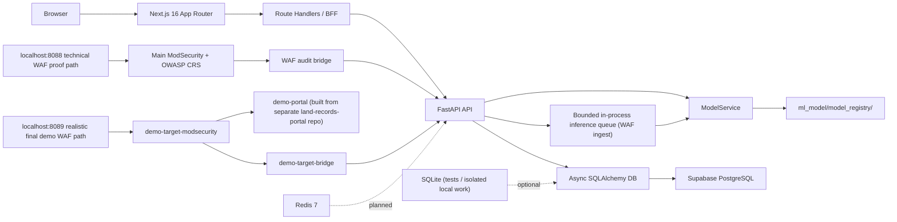

# Architecture

Last updated: 2026-07-03

This document describes the current repository architecture. It distinguishes between what is implemented now and what remains planned.

Client-stated security and alerting requirements are tracked in `docs/client-requirements.md`. They are architectural drivers for planned account security and alerting work, but not all are implemented in the current repository state.

## Current Topology



## Feature State Matrix

| Feature | Current State | Evidence |
|---|---|---|
| Browser dashboard path | Implemented | `frontend/app/api/*`, `frontend/proxy.ts`, `frontend/lib/bff-client.ts` |
| FastAPI routes and BFF calls | Implemented | `web_app/presentation/api/routes.py`, `frontend/app/api/*` |
| ModelService runtime boundary | Implemented | `web_app/services/model_service.py` |
| WAF ingest endpoint | Verified local proof | `POST /api/internal/waf-events`, `GET /api/internal/waf-events/{transaction_id}`, targeted route tests `11 passed` |
| WAF JSONL bridge | Verified local proof | `scripts/waf_audit_bridge.py`; targeted bridge tests `37 passed`; live bridge posted `status=200` for transaction `17821639659.909603` |
| ModSecurity request path | Verified local proof | `localhost:8088` is the technical CyberTrace backend WAF proof path; SQLi blocks with HTTP 403 and writes `logs/modsecurity/modsec_audit.jsonl` |
| Demo-target WAF ingest path | Verified local PD2 proof | `localhost:8089` is the realistic protected demo website path; `demo-target-bridge` forwards separate `logs/modsecurity/demo-target/modsec_audit.jsonl` events; transaction `178249138618.813428` reached FastAPI as `/records/search`, `SQL Injection`, `BLOCKED`, `crs_score=15` |
| Backend Compose exposure | Implemented | backend is internal-only in Compose and shown as `8000/tcp`; proof lookup uses `docker compose exec`, not `localhost:8000` |
| Inference queue | Implemented | `web_app/application/inference_queue.py`; targeted tests cover synchronous WAF ingest, queue overflow, and queue health |
| Request/trace context | Implemented | request middleware preserves or generates safe IDs, returns `X-Request-ID` on handled and generic unhandled `500` responses, and preserves valid W3C version-00 `traceparent` IDs |
| Structured observability logs | Implemented | request/WAF/prediction boundaries and bridge operational/configuration events emit JSON; redaction and correlation behavior are covered by targeted tests |
| Real-time dashboard alerts | Planned | no SSE/EventSource implementation found |
| Email notifications | Planned | no transactional email integration found |
| RBAC secure login | Implemented | current `frontend/auth.ts` uses named `AUTH_USERS_JSON` accounts, role claims, `authz_version`, and route-guard freshness checks |
| Auth/security schema foundation | Implemented | additive Alembic migration creates public-schema auth/security tables with RLS, explicit public-role revocations, and no policies; `frontend/lib/server/db/` contains the server-only service-role boundary |
| 2FA/MFA | Planned | no factor enrollment/challenge/recovery flow found |
| `CRITICAL >=90%` confidence tier | Implemented | current contracts expose LOW/MEDIUM/HIGH/CRITICAL with legacy severity compatibility |
| Runtime enforcement | Partial | `action_taken` is recorded; no request-path block/throttle/challenge enforcement found |
| Retraining pipeline | Planned | `ml_model/retraining/README.md` documents design-level only |
| Wazuh export | Planned | no Wazuh JSON/JSONL export implementation found |
| Full Wazuh/SIEM, Kubernetes, Kafka/Celery/Elasticsearch | Deferred | PD2 scope keeps these out unless explicitly approved |

## Backend

### Layering

The backend follows the intended Clean Architecture split:

- `web_app/domain/`
  - Domain contracts and entities
- `web_app/application/`
  - Use cases such as triage and feedback
- `web_app/infrastructure/`
  - Database setup and repository implementations
- `web_app/presentation/`
  - FastAPI app factory, route handlers, and request/response schemas

### Runtime entrypoint

- App factory: `web_app.presentation.app:create_app`
- Lifespan startup initializes the database, loads `ModelService`, and starts
  the bounded in-process inference queue used by WAF ingest.

### Current routes (2026-07-03)

- Protected by backend bearer auth:
  - `POST /api/predict`
  - `POST /api/triage`
  - `GET /api/alerts`
  - `GET /api/alerts/{id}`
  - `PATCH /api/alerts/{id}/triage`
  - `GET /api/stats`
  - `GET /api/ml-health`
- Internal bearer-token protected backend endpoints:
  - `POST /api/internal/waf-events`
  - `GET /api/internal/waf-events/{transaction_id}`
  - `POST /api/feedback`
- Public backend endpoints:
  - `GET /health`
  - `GET /api/health`

### Model loading behavior

- `web_app/services/model_service.py` is the runtime model boundary.
- In production mode, `MODEL_REGISTRY_PATH` must point to an explicit model run directory.
- In development and testing, the service can resolve the latest staged run from a broader directory, or fall back to a mock service if the configured path does not exist.
- The active model artifact tree is under `ml_model/model_registry/`.

## Frontend

### App structure

- Framework: Next.js 16 App Router
- Auth: Auth.js credentials provider with JWT sessions
- Data layer: TanStack Query + Zod
- Client state: Zustand

### Client-Required Account Security

The current Auth.js credentials flow is the named-account foundation. Client requirements still call for:

- secure login backed by real user access management,
- RBAC for role-specific access such as Admin and Analyst,
- strong account security controls,
- 2FA.

Implemented in the current foundation:

- named `AUTH_USERS_JSON` accounts with scrypt password hashes,
- `ADMIN`/`ANALYST`/`VIEWER` session claims,
- per-account `authz_version` freshness checks in BFF route guards,
- local login hardening with generic errors, dummy verification, throttles, and JSON audit events.
- alerts UI role affordances in the dashboard: viewers are read-only, analysts keep triage controls, and admins keep the full control set.

These are planned requirements. They should be implemented by extending the existing Auth.js boundary or by selecting a managed auth provider, not by hand-rolling session handling.

### Security boundary

The intended boundary is:

```text
Browser -> Next.js Route Handler -> FastAPI
```

This remains the correct direction for the project. Browser-to-FastAPI direct calls are not part of the intended architecture.

Next.js route handlers remain the browser-facing boundary, but the implemented handlers are not anonymous: the dashboard BFF handlers call `auth()` and return `401` without a valid session. They are still the right place to proxy or reshape backend data for the dashboard.

### Current BFF status (2026-07-03)

- `frontend/lib/bff-client.ts` is the shared server-only BFF client.
- All five route handlers wired:
  - `frontend/app/api/alerts/route.ts` (GET list)
  - `frontend/app/api/alerts/[id]/route.ts` (GET detail)
  - `frontend/app/api/alerts/[id]/triage/route.ts` (PATCH triage)
  - `frontend/app/api/stats/route.ts`
  - `frontend/app/api/ml-health/route.ts`
- Those five handlers all require a valid Auth.js session via `auth()`.
- `USE_MOCK_API` is the single centralized server-only mock toggle (currently **false**).
- The BFF validates transport payloads with Zod and preserves backend-emitted `action_taken` values: `BLOCKED`, `THROTTLED`, `ALLOWED`.
- The alerts table and alert drawer now hide unavailable dense-row mutation controls for viewers and preserve triage/action control visibility according to the current role.
- `frontend/proxy.ts` is the active edge entrypoint for protected dashboard routes.

## Data and Persistence

### Current database reality

- Async SQLAlchemy is the persistence layer today
- The ORM model is `TrafficLog`
- Tests use SQLite
- Isolated local work can still use SQLite when needed
- The current app runtime is wired to Supabase-backed PostgreSQL
- The auth/security schema foundation is implemented additively; it does not make Supabase the account-login source of truth
- New auth/security tables use the current `public` schema convention with RLS and no anon/authenticated policies. RLS is defense-in-depth only because service-role access bypasses it; server-only credential isolation is the actual boundary
- Current Auth.js login remains `AUTH_USERS_JSON`-backed with scrypt and is unchanged
- Some Supabase policy and operational guardrails still live outside repo automation

## ML Artifacts and Training Config

- Staged artifacts live under `ml_model/model_registry/staging/`
- Evaluation outputs live under `ml_model/model_registry/eval/`
- Model configs live under `config/models/`
- Current runtime defaults align with the DistilBERT staging path and the locked confidence thresholds

## What Is Present But Not Yet The Primary Runtime Path

- A local `docker-compose.yml`
- Backend and frontend Dockerfiles
- A verified local Compose ModSecurity + OWASP CRS proof path through `localhost:8088`
- A demo-target WAF profile through `localhost:8089`; the profile is optional for normal developer startup, but required for the final realistic WAF demonstration. It builds `demo-portal` from the separate land-records portal repo path, runs it as an internal Compose service on port `3010`, and does not publish portal port `3010` to the host by default.
- Internal WAF event ingest route and JSONL bridge tooling

## What Is Planned, Not Implemented

- Production-grade ModSecurity-fronted deployment
- Redis-backed IP blocklist, rate-limit state, and low-confidence queue only if shared runtime state is required
- Full repo-managed export and automation of Supabase policy state
- Client-required real user access management, RBAC, and secure login
- Client-required 2FA
- Client-required email notifications after detection
- Wazuh export-only JSON/JSONL integration
- Production edge checklist, backup/restore runbook, and archive/hide retention policy

## Current limitations

- `PROCESSING` placeholder rows are hidden from normal alerts and stats reads. Expired leases are automatically reclaimed via the `lease_expires_at` field when a later request finds the lease stale.
- `ModelService.predict()` still returns compatibility aliases such as `class` and `confidence_level` alongside the canonical `prediction` and `confidence_tier` fields.
- The dashboard still relies on BFF-derived display fields for some stats and ML-health cards because the backend payloads intentionally stay narrower than the frontend contract.
- Current confidence tiers are `LOW`, `MEDIUM`, `HIGH`, and `CRITICAL`. Preferred filter/query naming is `confidence_tier`, the persisted backend field remains `confidence_level`, and the legacy `severity` query alias remains for compatibility.
- `CRITICAL >=90%` is implemented as the top confidence threshold, and historical rows are not retroactively reclassified.
- Persisted-alert dashboard aggregations use backend-emitted `confidence_level`; the frontend does not reclassify stored alerts from raw confidence or current ML-health thresholds.
- Confidence distributions include all predictions, while enforcement-policy counts include non-Normal predictions only. Normal predictions remain `ALLOWED` at every valid confidence tier.
- Confidence-tier badges always display `LOW`, `MEDIUM`, `HIGH`, or `CRITICAL`; prediction labels such as Normal/benign remain separate UI concepts.
- Current action values are recorded metadata, not proof of live network enforcement.
- Bridge follow mode transient `readline()` `OSError` recovery is implemented and unit-tested; the follow loop preserves the last safe file position, warns, sleeps briefly, reopens, and continues processing later lines. Full log rotation and production retention remain future ops hardening.

## Architecture Notes For Future Edits

- Do not document planned infrastructure as shipped behavior.
- Keep the live path names exact. Runtime artifacts live under `ml_model/model_registry/`.
- Keep setup docs and architecture docs synchronized with the route handlers and tests, not with older planning files.
- Latest operator baseline is tracked in `docs/project-ops/STATUS.md`; do not copy old test counts forward without rerunning.
