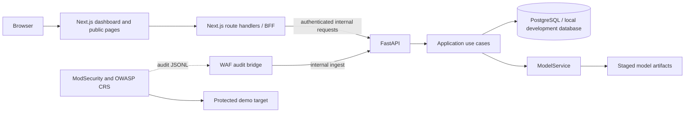

# Architecture

This is a short map of the current application boundaries and the constraints
that matter when changing them. It describes repository design, not proof that
the hosted deployment is configured or operating this way. See
[`project-ops/STATUS.md`](project-ops/STATUS.md) for dated verification and
[`project-ops/IMPLEMENTATION_GAP_REGISTER.md`](project-ops/IMPLEMENTATION_GAP_REGISTER.md)
for open work.

## System at a glance

```mermaid
flowchart LR
    User[Browser] --> Web[Next.js dashboard and public pages]
    Web --> BFF[Next.js route handlers / BFF]
    BFF -->|authenticated internal requests| API[FastAPI]
    API --> App[Application use cases]
    App --> Data[(PostgreSQL / local development database)]
    App --> Model[ModelService]
    Model --> Artifacts[Staged model artifacts]
    WAF[ModSecurity and OWASP CRS] -. audit JSONL .-> Bridge[WAF audit bridge]
    Bridge -->|internal ingest| API
    WAF --> Protected[Protected demo target]
```

The browser talks to Next.js, not directly to FastAPI. The optional WAF path
forwards audit evidence to FastAPI; it is separate from the dashboard request
path.

## Main components

| Component | Responsibility |
| --- | --- |
| `frontend/` | Next.js UI, Auth.js sessions, and server-side BFF route handlers. The BFF validates payloads and calls FastAPI. |
| `web_app/` | FastAPI presentation routes, application use cases, domain rules, and infrastructure adapters. |
| `web_app/services/model_service.py` | Loads the selected model artifact and provides the inference boundary. |
| `web_app/infrastructure/` | Async database access and repository implementations. `traffic_logs` is the canonical traffic/detection record. |
| `web_app/notifications/` | Durable outbox and worker/provider boundary; dated delivery evidence belongs in Project Ops Status. |
| `ml_model/model_registry/` | Versioned/staged model artifacts. The web app does not automatically promote a model to production. |
| `config/modsecurity/` and `scripts/waf_audit_bridge.py` | Optional ModSecurity/CRS audit collection and forwarding for local proof/demo paths. |

The backend dependency direction is `domain → application → infrastructure →
presentation`. Keep HTTP concerns in presentation, business decisions in
application/domain code, and database details in infrastructure.

## Important behavior and boundaries

- **Authentication and API access:** Auth.js protects the dashboard session;
  BFF route handlers enforce permissions and call FastAPI with server-side
  credentials. Supabase service-role credentials must remain server-only.
- **Traffic and alerts:** `traffic_logs` stores classified traffic. An
  operational alert is a filtered view of actionable classifications, not a
  separate source-of-truth table. Current actionable classes are SQL Injection
  and Code Injection; `Normal` is not an alert.
- **Traffic History export:** CSV requests keep the current filters and pass
  through the authenticated same-origin BFF to FastAPI. The dialog supports
  close controls, Escape, and backdrop dismissal. Inclusive calendar dates use
  the selected timezone, allow at most 31 days, and cannot extend past today;
  FastAPI repeats the date check before querying.
- **Evidence is not outcome:** model confidence is not attack severity. A
  recorded action or policy decision does not by itself prove what the WAF or
  origin returned. Observed HTTP outcome and WAF evidence are separate facts.
- **Correlation is not deduplication:** a shared request-correlation ID can
  associate records from different producers. It does not mean those records
  are interchangeable; similar IP, route, payload, or time is not enough to
  merge them safely.
- **Model work:** inference uses the configured artifact. Reviewed feedback and
  retraining workflows do not automatically replace the production artifact.
- **Process-local services:** the WAF inference queue and alert-event/SSE
  broadcaster are in memory. The current design does not provide durable SSE
  replay or multi-process event fan-out.
- **WAF proof scope:** local ModSecurity and demo-target paths demonstrate a
  controlled integration path. They do not, by themselves, prove hosted
  Cloudflare/origin trust or production enforcement.

## Where to look next

- [Local development and configuration](SETUP.md)
- [Documentation index](README.md)
- [Dated project status](project-ops/STATUS.md)
- [Smoke-test procedures](project-ops/SMOKE_TEST_RUNBOOK.md)
- [Migration and rollback safeguards](project-ops/MIGRATION_ROLLBACK_RUNBOOK.md)
- [ML operations](project-ops/ML_MODEL_OPERATIONS_RUNBOOK.md)
