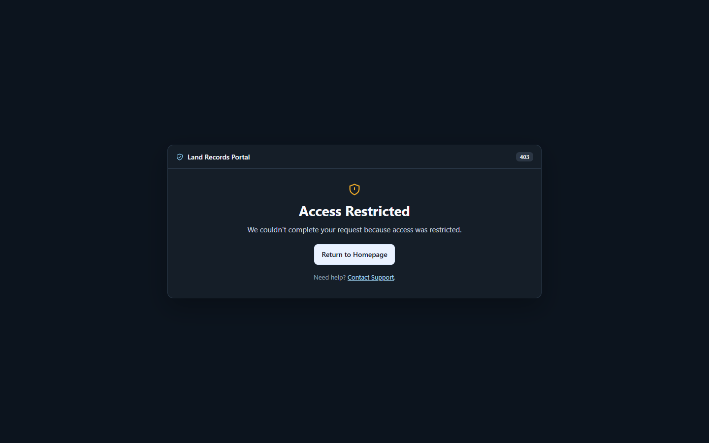
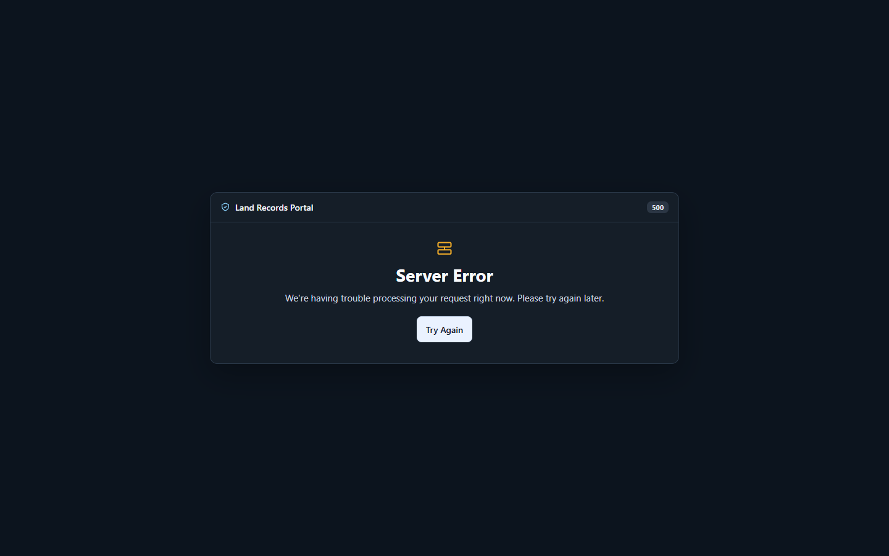
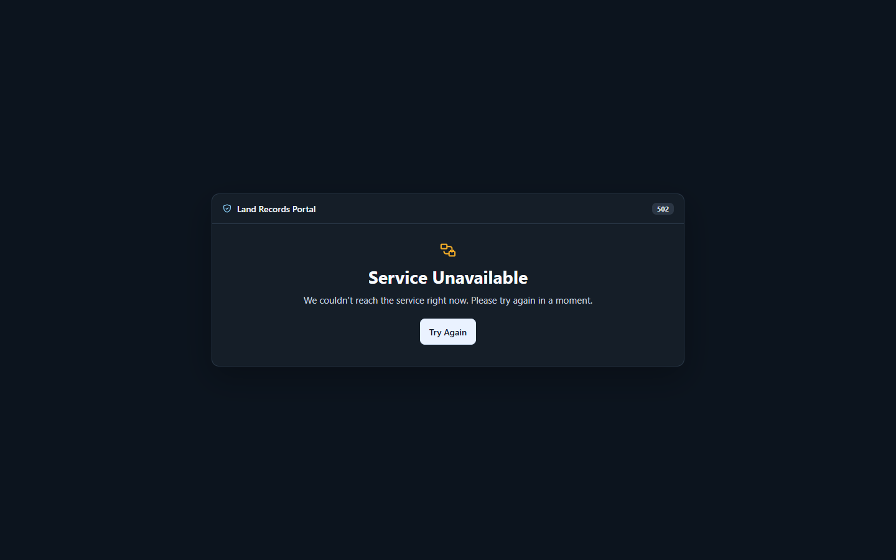

# Local HTTP error page evidence

Captured from an isolated local Compose project on 2026-09-25 at 1440 × 900.
The browser-visible responses retained their originating statuses and loaded
the shared stylesheet. The 502 was produced by stopping only the isolated test
portal container.

| Response | Local result |
| --- | --- |
| ModSecurity 403 | 403, HTML, `no-store`, `no-referrer`, `nosniff`, transaction ID |
| NGINX generated 500, 503, 504 | Matching statuses and HTML pages from isolated status routes |
| NGINX upstream 502 | 502, HTML, `no-store`, `no-referrer`, `nosniff`, transaction ID |

