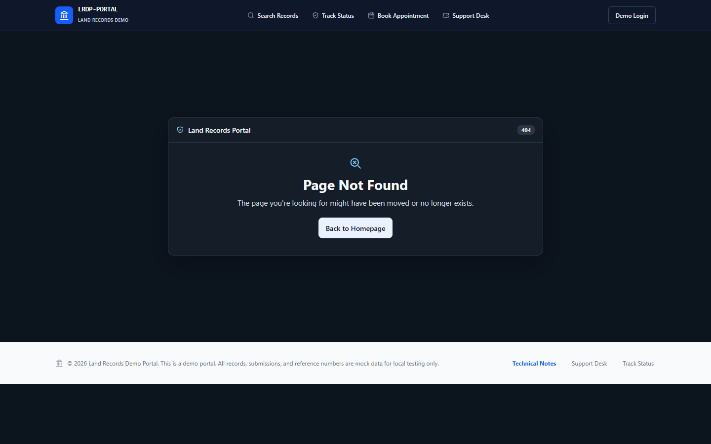
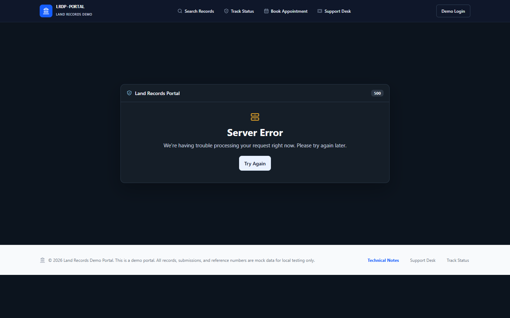
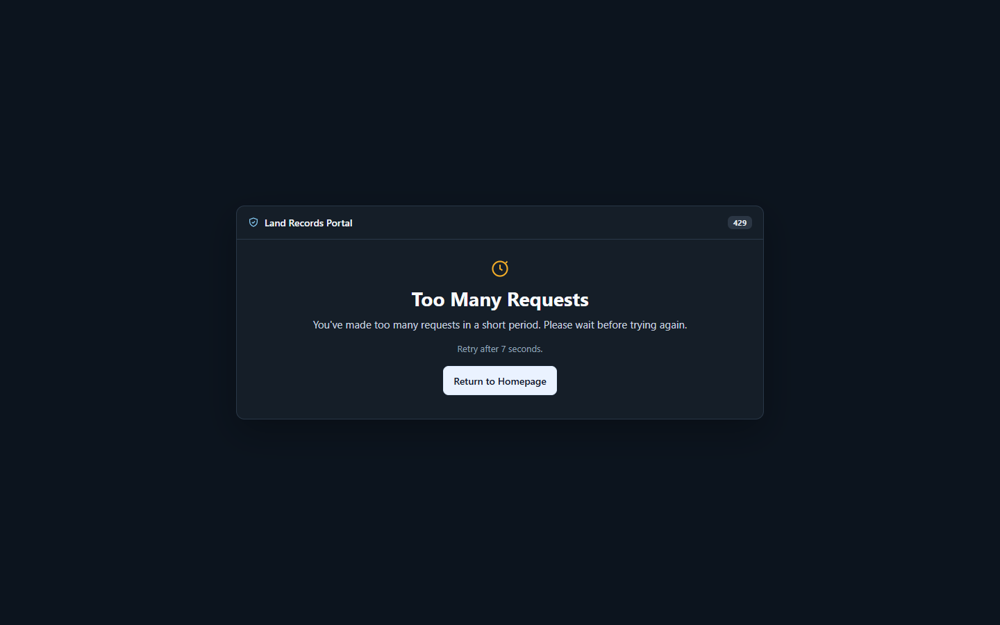

# Local portal error page evidence

Captured from the isolated local portal on 2026-09-25 at 1440 × 900.

| Response | Local result |
| --- | --- |
| Portal 404 | 404 response with the branded page inside the existing site layout |
| Portal 500 | 500 response with the shared page-level error component |
| Portal 429 | Enforcement boundary fixture returned 429 with `Retry-After: 7`; the UI showed the same fixture value |

The 429 interval shown here is a test value, not the deployed rate-limit
configuration.

