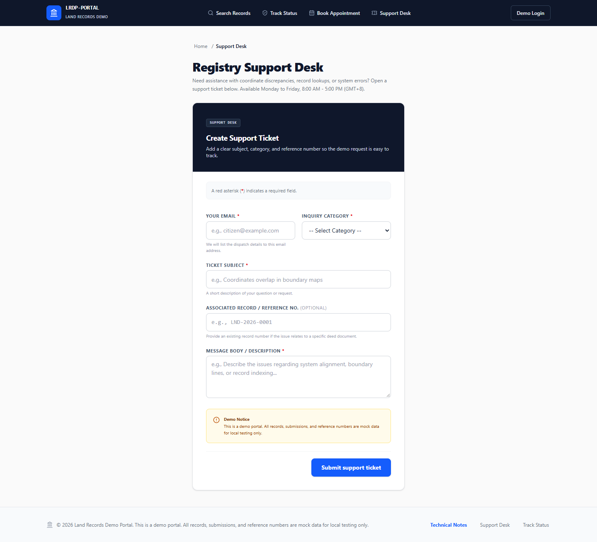
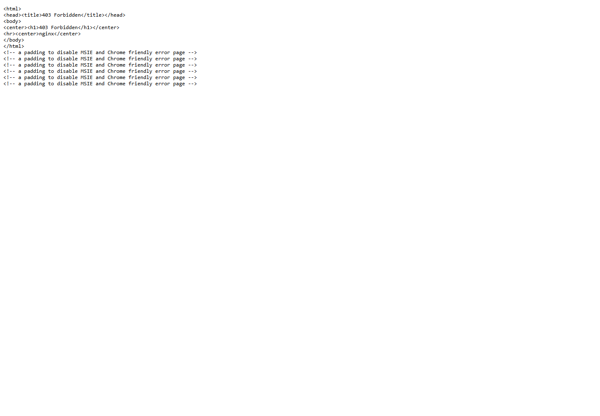

# M8 multi-route WAF-ML integration and evidence

Status: **route integration implemented; local end-to-end coverage partial**
Run: `20260924T145330Z-55e2adb3`
Date: 2026-09-24
Environment: isolated local Docker Compose, shadow enforcement, fresh container-local SQLite backend database and temporary portal database.

## What changed

- The target portal sends allowlisted text from five POST workflows to the existing authenticated FastAPI WAF event endpoint before business writes: Book Appointment, Support Desk, Demo Login, Request-copy, and Comments. Passwords, names, email addresses, tokens, query strings, and arbitrary headers are excluded from this bridge. The backend uses submitted text transiently for inference and does not retain the body or normalized model-input text for `portal_route_bridge` rows.
- The existing M7 successful-GET path remains the source for eight normal page/query requests. Its ModSecurity access-log allowlist is GET-only so the same POST is not ingested both through M7 access telemetry and the M8 portal bridge.
- CRS-blocked requests continue through the independent ModSecurity audit bridge. They do not reach the portal route handler. The test report distinguishes a ModSecurity 403 from the ML recommendation and the response observed by the client.
- NGINX forwards a generated edge request ID to the portal and returns it in a response header. The portal uses that ID only when it matches the strict 32-hex proxy format; otherwise it generates a UUID. The backend lookup response includes `model_version` for correlation.
- The Cloudflare target overlay gives the portal access to the backend only over an internal Compose network and configures the internal ingest keys and source-trust mode. The backend remains unpublished to the host in that overlay.
- `docker-compose.m08-multi-route-test.yml` and `scripts/multi_route_waf_e2e_tester.py` provide a local-only, route-aware matrix. The runner limits request rate, rejects non-local origins, records unique IDs and outcomes, never follows attack redirects, and does not write submitted values into its JSON/CSV report.

These choices follow OWASP guidance to keep security logs purpose-limited and avoid collecting secrets, use server-side validation and narrowly scoped inputs, and treat resource consumption as a control concern. ModSecurity CRS remains an independent ingress control; FastAPI/Next.js route handlers retain their own boundaries. References: [OWASP Logging Cheat Sheet](https://cheatsheetseries.owasp.org/cheatsheets/Logging_Cheat_Sheet.html), [OWASP Input Validation Cheat Sheet](https://cheatsheetseries.owasp.org/cheatsheets/Input_Validation_Cheat_Sheet.html), [OWASP API4:2023](https://api-security.owasp.org/editions/2023/en/0xa4-unrestricted-resource-consumption/), [OWASP CRS documentation](https://coreruleset.org/docs/index.print), [ModSecurity v3 reference manual](https://github.com/owasp-modsecurity/ModSecurity/wiki/Reference-Manual-%28v3.x%29), [Next.js Route Handlers](https://nextjs.org/docs/app/getting-started/route-handlers), and [FastAPI Background Tasks](https://fastapi.tiangolo.com/tutorial/background-tasks/). The implementation reuses the current proxy, bridge, FastAPI ingestion and alert paths; it does not add a queue or another service.

## Local route matrix

The runner submitted 13 legitimate workflows and 18 controlled attack probes. All 31 received a `COMPLETED` CyberTrace event. All 13 normal workflows completed; the five normal POSTs followed their 303 redirects and rendered the expected confirmation, while Search Records, Track Status, Record Detail, and Request-copy returned their expected record/tracking markers. The other normal pages returned HTTP 200. All 16 CRS-matched attack probes returned 403 before the portal. Two code-injection probes did not match CRS and therefore exercised direct portal-to-ML ingestion and normal application handling in shadow mode.

| Surface | Normal request | SQL injection probe | Code injection probe |
| --- | --- | --- | --- |
| Search Records (GET) | 200, expected record marker, `Normal` | CRS 403; `SQL Injection`, alert visible | CRS 403; classified as `SQL Injection` (wrong subtype), alert visible |
| Track Status (GET) | 200, expected tracking marker, `Normal` | CRS 403; `SQL Injection`, alert visible | CRS 403; classified `Normal` (miss) |
| Record Detail (GET) | 200, expected record marker, `Normal` | CRS 403; `SQL Injection`, alert visible | CRS 403; `Other Attacks` (outside supported alert scope) |
| Request-copy page (GET) | 200, expected record marker, `Normal` | CRS 403; `SQL Injection`, alert visible | CRS 403; `Other Attacks` (outside supported alert scope) |
| Book Appointment (POST) | 303 then 200 confirmation; false-positive `SQL Injection` / CRITICAL; ML recommendation `BLOCKED`, recorded policy decision MONITOR | CRS 403; audit inference was `Normal` (miss) | CRS did not block; direct bridge classified `Code Injection` / HIGH; ML recommendation `BLOCKED`, recorded policy decision MONITOR; application returned its normal 303 then 200 confirmation |
| Support Desk (POST) | 303 then 200 confirmation; false-positive `SQL Injection` / CRITICAL; ML recommendation `BLOCKED`, recorded policy decision MONITOR | CRS 403; audit inference was `Normal` (miss) | CRS 403; audit inference was `Normal` (miss) |
| Demo Login (POST) | 303 then 200 confirmation; `Normal`; password excluded from direct bridge | CRS 403; audit inference `Other Attacks` | CRS 403; audit inference `Other Attacks` |
| Request-copy submission (POST) | 303 then 200 confirmation; `Normal` | CRS 403; audit inference `Normal` (miss) | CRS 403; audit inference `Normal` (miss) |
| Comments (POST) | 303 then 200 confirmation; false-positive `SQL Injection` / CRITICAL; ML recommendation `BLOCKED`, recorded policy decision MONITOR | CRS 403; audit inference `Normal` (miss) | CRS did not block; direct bridge classified `Code Injection` / MEDIUM; conditional throttle recommendation; application returned its normal 303 then 200 confirmation |

Across the 18 attack probes, the exact supported class matched 6 times: 4/9 SQL injection and 2/9 code injection. The matrix's 10 actionable alert IDs were all found in the Alerts API response. Normal classifications matched 6/13; three successful normal form submissions were false-positive CRITICAL SQL injection predictions, and four normal page requests were classified `Other Attacks`. Do not interpret the 10 alerts as 10 confirmed attacks.

## Enforcement and interpretation

The route matrix ran with `ENFORCEMENT_MODE=shadow`. Its policy values are persisted recommendations; they did not cause an ML block or throttle. The observed 403s were generated by ModSecurity/CRS and their audit transactions were ingested separately. For direct form-ingestion events without CRS evidence, HIGH/CRITICAL ML recommendations of `BLOCKED` were recorded as policy decision `MONITOR` because strong evidence was absent. The MEDIUM policy is conditional: the active backend gate returns allow while evidence is pending and throttles only when strong WAF evidence exists or the configured repeat threshold is reached. The M8 matrix did not claim to demonstrate an applied ML throttle or block.

The local direct-ingress test has no verified Cloudflare client provenance; its source is explicitly `UNVERIFIED`. No hosted database, public Cloudflare path, authenticated dashboard UI session, email delivery, or production enforcement path was used. Alert visibility was checked through the authenticated/internal Alerts API used by the test stack, not a user browser session. `/api/stats` returned 26 for its operational projection during the matrix; it is not a one-to-one count of the 31 matrix rows and includes the service's classification filters and adjacent M7 page requests.

Supplemental browser evidence used a separate local browser against the same isolated stack. Support Desk loaded with HTTP 200. A unique Search Records SQL probe returned HTTP 403 from ModSecurity; transaction `179026171871.125691` correlated to edge request ID `e18fc31d9c118e25c3e7d6b6ef7ede17`, completed as SQL Injection at 0.999276 / CRITICAL, and produced alert 54 visible through the Alerts API. The observed 403 remains a ModSecurity effect, not proof of an ML-generated block. Source verification for this local request was `UNVERIFIED`.

## Reproduction

Provide the demo portal checkout, a new temporary portal database file, temporary audit/results directories, and the required internal keys through ignored local environment configuration. Start only the isolated Compose project:

```powershell
docker compose --env-file .env -p cybertrace-m08-e2e-clean -f docker-compose.m08-multi-route-test.yml up -d --build
docker compose -p cybertrace-m08-e2e-clean -f docker-compose.m08-multi-route-test.yml exec backend python /app/scripts/multi_route_waf_e2e_tester.py --origin http://demo-target-modsecurity:8080 --backend http://127.0.0.1:8000 --max-rps 1 --output-dir /app/m08-e2e-results
docker compose -p cybertrace-m08-e2e-clean -f docker-compose.m08-multi-route-test.yml down
```

Use a fresh project name and temporary database/log/result paths for each run. Do not add `--volumes` when stopping the stack if the report or evidence is still needed. The runner is bounded to 2 requests/second maximum and checks that its origin and backend are local test endpoints.

Saved artifacts for this run:

- JSON and CSV matrix: [`evidence/m08-route-matrix-20260924T145330Z-55e2adb3.json`](evidence/m08-route-matrix-20260924T145330Z-55e2adb3.json) and [`evidence/m08-route-matrix-20260924T145330Z-55e2adb3.csv`](evidence/m08-route-matrix-20260924T145330Z-55e2adb3.csv)
- Browser correlation: [`evidence/m08-ui-modsecurity-correlation.json`](evidence/m08-ui-modsecurity-correlation.json)
- Local browser captures: [`evidence/m08-support-form.png`](evidence/m08-support-form.png) and [`evidence/m08-modsecurity-search-blocked.png`](evidence/m08-modsecurity-search-blocked.png)





## Remaining work

- Improve model classification quality before treating these surfaces as reliable ground-truth attack detectors. Keep `Other Attacks` outside operational alert scope and do not adjust thresholds or relabel observations to improve counts.
- Obtain authorized staging evidence with verified Cloudflare provenance for the actual conditional throttle/block response paths. The local shadow matrix cannot establish those runtime effects.
- Verify the authenticated dashboard UI and hosted data path separately; current evidence proves Alerts API visibility only.
- Build a larger adjudicated sample set only after fixing the route-level integration and classification misses above. This run does not meet the longer-term 20-sample-per-category target.
