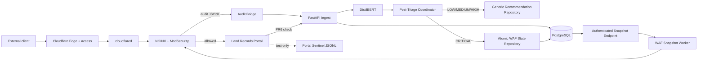
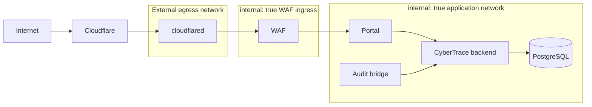

# PR7 Sections 3B and 3C
## Trusted Full-System Enforcement, Resilience, Recovery, and Final Evidence Plan

**Project:** CyberTrace Injection Alert System  
**Repository:** `PooKYZZZ/injection-alert-system`  
**Verified baseline:** `master` at merge commit `66798691e7da91dc78b9f8e11ab61d5afa48c50e` (PR #99)  
**Planning date:** 2026-07-31  
**Document status:** Implementation-ready technical design and verification plan; no repository changes are included  
**Development constraint:** Work directly in the existing local repository on `master`; do not create a second clone, worktree, temporary branch, or replacement architecture

---

## Table of Contents

1. [Executive Summary](#1-executive-summary)
2. [Project and Requirements Understanding](#2-project-and-requirements-understanding)
3. [Assumptions and Ambiguities](#3-assumptions-and-ambiguities)
4. [Acceptance Criteria](#4-acceptance-criteria)
5. [Current System Analysis](#5-current-system-analysis)
6. [Research Findings](#6-research-findings)
7. [Requirements Traceability Matrix](#7-requirements-traceability-matrix)
8. [Section 3B Technical Design](#8-section-3b-technical-design)
9. [Section 3C Technical Design](#9-section-3c-technical-design)
10. [Dependencies Between 3B and 3C](#10-dependencies-between-3b-and-3c)
11. [Recommended Architecture](#11-recommended-architecture)
12. [Alternatives and Trade-offs](#12-alternatives-and-trade-offs)
13. [Security and Privacy Review](#13-security-and-privacy-review)
14. [File-by-File Change Plan](#14-file-by-file-change-plan)
15. [Implementation Blueprint](#15-implementation-blueprint)
16. [Code Examples](#16-code-examples)
17. [Testing Strategy](#17-testing-strategy)
18. [Conditional Designs](#18-conditional-designs)
19. [Failure Modes and Recovery](#19-failure-modes-and-recovery)
20. [Observability](#20-observability)
21. [Performance and Cost](#21-performance-and-cost)
22. [Migration and Rollback](#22-migration-and-rollback)
23. [Pull Request Checklist](#23-pull-request-checklist)
24. [Definition of Done](#24-definition-of-done)
25. [Open Questions and Assumptions](#25-open-questions-and-assumptions)
26. [Sources](#26-sources)

---

# 1. Executive Summary

PR #99 completed the controlled-local PR7 Block 3A lifecycle:

```text
Injection request
→ ModSecurity/OWASP CRS audit event
→ authenticated audit bridge
→ FastAPI ingest
→ locked real DistilBERT inference
→ verified non-Normal CRITICAL result
→ atomic PR7 WAF recommendation and effective state
→ authenticated snapshot
→ WAF rule activation
→ matching source/path receives HTTP 403
→ wrong source/path remains allowed
→ revocation restores normal traffic
```

The remaining work is not a redesign of the model, policy, database, API, or WAF state contract. It is final system integration and evidence work.

## Main recommendation

Implement Sections 3B and 3C as two related but independently runnable evidence profiles:

- **Section 3B — Trusted external ingress and integrated enforcement proof.** Reuse the existing Cloudflare Tunnel isolation topology, connect it to the complete PR7 runtime, prove exact source equivalence, prove direct-origin isolation, add portal-owned no-upstream evidence, and verify the full Normal/LOW/MEDIUM/HIGH/CRITICAL policy matrix.
- **Section 3C — Resilience, recovery, and measurement proof.** Reuse the current WAF synchronizer and state contract, add deterministic failure controls, prove expiry and delayed revocation semantics, validate restart and stale-state resistance, measure latency/capacity, and always finish disabled, empty, and cleaned up.

Create two Compose overlays rather than one oversized test topology:

```text
docker-compose.pr7-block3b.yml   # live Cloudflare and full portal integration
docker-compose.pr7-block3c.yml   # deterministic local failure injection
```

The work should primarily add:

- Compose integration and static topology assertions.
- A test-only portal sentinel.
- Shared E2E harness utilities.
- Guarded live Cloudflare proof tooling.
- Resilience and recovery scenarios.
- Repeatable timing and capacity evidence.
- Project documentation and closure records.

## Scope classification

| Classification | Work |
|---|---|
| **Required now** | 3B trusted ingress proof, source equivalence, origin isolation, portal sentinel, PR6/PR7 matrix, 3C expiry/revocation/restart/snapshot/failure tests, final safe state |
| **Recommended now** | Shared harness extraction, structured timing fields, artifact lock for portal/model/container inputs, static Compose assertions |
| **Optional future improvement** | IPv6-capable PR7 snapshot/runtime, automated database expiry cleanup, hosted rollout automation, production dashboards |
| **Unnecessary for present scope** | New database schema, Redis, queues, Celery, Kafka, Kubernetes, Terraform, a new service layer, a new WAF engine, a new ML model, a new public API |

## Completion statement

When this plan passes, PR7 may be described as fully implemented and validated for the approved controlled thesis scope. It must **not** be described as approved for general production rollout unless the separate rollout, shared-IP risk, identity, secret-distribution, and operational gates are explicitly approved.

---

# 2. Project and Requirements Understanding

## 2.1 Project purpose

CyberTrace detects injection-related web traffic, classifies events with a DistilBERT model, persists traffic and enforcement state, and applies confidence-tiered controls through two enforcement layers:

1. **PR6 application enforcement** for LOW, MEDIUM, and HIGH recommendations.
2. **PR7 WAF enforcement** for eligible CRITICAL recommendations.

The protected scope is the exact portal path `/records/search`.

## 2.2 Verified technology stack

| Area | Current technology |
|---|---|
| Backend | Python 3.14+, FastAPI, Pydantic 2 |
| Architecture | Clean Architecture: `domain → application → infrastructure → presentation` |
| Persistence | SQLAlchemy 2 async, PostgreSQL runtime, SQLite for many ordinary tests, Alembic |
| ML | PyTorch/Transformers DistilBERT with locked model artifacts |
| Portal | Next.js 16, React 19, Auth.js, Zod, TanStack Query, Zustand |
| WAF | NGINX, ModSecurity, OWASP Core Rule Set |
| Audit transport | Python JSONL audit bridge |
| Integration runtime | Docker Compose |
| Test framework | pytest plus project-specific Compose/E2E harnesses |

## 2.3 Current architecture

### Detection and persistence

```text
ModSecurity audit transaction
→ scripts/waf_audit_bridge.py
→ POST /api/internal/waf-events
→ source provenance verification
→ idempotent traffic persistence
→ model inference
→ prediction and confidence persistence
→ post-triage enforcement coordination
```

### Enforcement ownership

`PostTriageEnforcementCoordinator` selects exactly one recommendation writer:

- Eligible CRITICAL, non-Normal, exact-path events route to the atomic PR7 WAF-state repository.
- All other eligible outcomes route to the existing generic PR6 recommendation use case.

This single-writer rule prevents a traffic event from acquiring both generic and WAF recommendation ownership.

### PR6 application layer

The portal calls:

```http
POST /api/internal/enforcement/check
```

The existing behavior is:

- LOW: allow initially, then challenge under the established request-window policy.
- MEDIUM: challenge, grant, count, then throttle under the established policy.
- HIGH: return exact internal `BLOCK`; the portal stops before protected record-search work.
- Protected-path evaluation failures: fail open to `ALLOW` after one bounded call, matching the approved PR6 design.

### PR7 WAF layer

Eligible CRITICAL events create atomic WAF recommendation/effective state. The WAF worker fetches an authenticated snapshot, validates it, renders deterministic ModSecurity rules, validates the candidate with NGINX, activates it, reloads, probes, and records selected metadata.

Current domain constants include:

```text
scope              = RECORD_SEARCH
path               = /records/search
policy version     = confidence-waf-enforcement-v1
default capacity   = 64
maximum entries    = 512
supported source   = canonical IPv4
```

## 2.4 Completed Block 3A behavior

Block 3A already proves the controlled-local end-to-end attack-to-WAF path with:

- PostgreSQL.
- Real locked model artifacts.
- ModSecurity audit generation.
- Audit bridge replay/idempotency hardening.
- Atomic state mutation.
- Authenticated snapshot consumption.
- Source/path isolation.
- WAF-side no-upstream evidence.
- Revocation and cleanup.

## 2.5 Intended Section 3B behavior

Section 3B must prove that the already-working CRITICAL lifecycle operates through the trusted external topology:

```text
External client
→ Cloudflare edge and Access
→ outbound Cloudflare Tunnel
→ isolated ModSecurity WAF
→ portal when permitted
→ audit bridge
→ CyberTrace
→ real model
→ CRITICAL PR7 state
→ WAF synchronization
→ later source-specific/path-specific block
```

It must also prove that:

- The source used for enforcement is the genuine external visitor identity carried through the trusted proxy path.
- Forged forwarding headers do not choose or bypass the enforcement identity.
- Neither WAF nor portal is directly reachable outside the approved tunnel path.
- PR6 and PR7 operate together without ownership or policy regression.
- A PR7 WAF block is proven by the portal’s own absence of request evidence, not only by WAF access logs.

## 2.6 Intended Section 3C behavior

Section 3C must prove that enforcement remains bounded and recoverable when:

- The backend is unavailable.
- Snapshot synchronization is unavailable.
- Revocation occurs during an outage.
- Absolute expiry occurs during an outage.
- The WAF process or container restarts.
- Snapshot responses are stale, malformed, unauthorized, oversized, conflicting, or otherwise invalid.
- The bridge stops and later replays accumulated audit lines.
- The rule set reaches normal and stress capacities.

It must produce repeatable measurements and finish with the disable latch present, canonical empty dynamic state selected, static CRS healthy, the portal healthy, and disposable resources removed.

## 2.7 Main constraints

- Preserve the existing `.env` location and environment-loading model.
- Do not introduce a new framework or infrastructure tier.
- Do not change confidence thresholds or recommendation policy.
- Do not change the snapshot schema or PR7 policy version unless a verified defect makes it unavoidable.
- Do not add a database migration for test evidence or measurements.
- Do not expose a new public endpoint for the portal sentinel.
- Do not enable hosted or production ENFORCE as part of this work.
- Keep the existing Block 3A evidence historical and reproducible.

## 2.8 Information still missing

The CyberTrace repository was inspected, but the sibling Land Records portal source was not available through the current repository connection. Therefore:

- Portal responsibilities are known.
- Exact portal file names and function names must be confirmed locally before editing.
- Portal paths in this document are explicitly marked **path to confirm**.

---

# 3. Assumptions and Ambiguities

## 3.1 Material ambiguities

| ID | Ambiguity | Why it matters | Adopted interpretation | Effect of another interpretation |
|---|---|---|---|---|
| A-01 | No repository document formally names “Section 3B” and “Section 3C” | Scope could drift | 3B means trust/integration proof; 3C means resilience/recovery/measurement | A different institutional definition would require remapping acceptance IDs, not redesigning the underlying features |
| A-02 | “Hosted trust topology” could imply production rollout | Production activation carries separate risk and approval | Use a controlled proof hostname behind Cloudflare Access; do not authorize general production traffic | Production rollout would require separate secrets, capacity, identity, operations, and rollback review |
| A-03 | Portal source file locations are unavailable | Exact modifications cannot be named safely | Mark portal paths as paths to confirm and identify responsibilities instead | Once inspected, replace hypothetical paths with verified paths before coding |
| A-04 | Database rows may remain `ACTIVE` after rule expiry | Could prompt an unnecessary scheduler | Data-plane expiry is sufficient; terminal cleanup occurs on the next existing lifecycle mutation/revocation | Immediate database cleanup would require explicit scheduler ownership and additional testing |
| A-05 | Revocation deadline is unspecified | An arbitrary threshold could be misleading | Measure baseline components first, then set a generous engineering ceiling | A contractual SLO would need an explicit numeric requirement and environment class |
| A-06 | Source proof with two networks may still encounter CGNAT | Network identity is not human identity | Prove equality and distinctness when observed; disclose shared-IP limitations | A unique-user guarantee would require a different identity binding strategy |
| A-07 | Portal sentinel write durability is unspecified | `fsync` on every request may distort timing | Use append-only, best-effort JSONL in disposable test mode; flush behavior should be sufficient for harness polling | Formal crash-durable evidence would justify stronger sync semantics and higher overhead |
| A-08 | Live Cloudflare proof cannot run in ordinary CI | External accounts and networks are unavailable | Guard it with explicit opt-in and report `NOT_RUN` when prerequisites are absent | A dedicated secured CI environment could automate it later |

## 3.2 Assumption register by confidence

| Type | Statement |
|---|---|
| **Confirmed fact** | PR #99 is merged on `master` and completes Block 3A controlled-local integration |
| **Confirmed fact** | `docker-compose.target-cloudflare.yml` already defines outbound `cloudflared`, internal networks, no WAF host port, and `/32` real-IP trust |
| **Confirmed fact** | PR7 currently supports canonical IPv4 only, default capacity 64, maximum 512 |
| **Reasonable assumption** | No CyberTrace database migration is needed for Sections 3B/3C |
| **Reasonable assumption** | A portal sentinel can be implemented using built-in Node filesystem APIs without a new dependency |
| **Unverified inference** | Existing WAF runtime behavior will pass most 3C scenarios without production-code changes |
| **Open decision** | Exact healthy-revocation engineering ceiling after measurement |
| **Open decision** | Exact portal file paths and test runner commands |

---

# 4. Acceptance Criteria

The acceptance criteria below are the implementation contract. Each criterion includes an initial condition, trigger, expected behavior/state, and failure behavior.

## 4.1 Section 3B functional criteria

### 3B-R1 — Integrated trusted topology

- **Initial condition:** The existing Cloudflare target topology and PR7 Block 3A runtime are available.
- **Trigger:** Start the 3B Compose profile with valid external secrets and explicit proof opt-in.
- **Expected behavior:** `cloudflared`, WAF, portal, bridge, backend, PostgreSQL, and the locked model form one working stack.
- **Expected state:** No WAF or portal host port exists; the public proof hostname is reachable through Cloudflare Access.
- **Failure behavior:** Startup stops with a clear prerequisite or health failure; it must not silently fall back to an untrusted direct-origin path.

### 3B-R2 — External source equivalence

- **Initial condition:** Two genuinely different client networks are available.
- **Trigger:** Each source sends normal and controlled attack requests through the proof hostname.
- **Expected behavior:** Cloudflare visitor identity, NGINX effective remote address, ModSecurity transaction client IP, bridge source, persisted `traffic_logs.source_ip`, and effective PR7 source are equal for each request.
- **Expected state:** Source A and Source B remain distinguishable when the networks expose distinct public addresses.
- **Failure behavior:** Any mismatch fails the proof and prevents a claim of trusted source enforcement.

### 3B-R3 — Forged forwarding-header resistance

- **Initial condition:** Trusted tunnel path is healthy.
- **Trigger:** Send forged `CF-Connecting-IP`, `X-Forwarded-For`, `X-Real-IP`, and `True-Client-IP` request headers.
- **Expected behavior:** The trusted Cloudflare/WAF-derived identity remains authoritative.
- **Expected state:** Forged values cannot create state for another source, bypass an existing block, or block an innocent source.
- **Failure behavior:** Any client-controlled identity substitution is a release-blocking security defect.

### 3B-R4 — Direct-origin isolation

- **Initial condition:** 3B stack is running.
- **Trigger:** Attempt host, LAN, and unrelated-container access to WAF and portal services.
- **Expected behavior:** Direct attempts fail; `cloudflared → WAF → portal` succeeds.
- **Expected state:** Only intended network peers share the ingress/application networks.
- **Failure behavior:** Any bypass path fails Section 3B.

### 3B-R5 — Portal-owned no-upstream evidence

- **Initial condition:** Test-only portal sentinel is enabled.
- **Trigger:** Execute Normal, HIGH, CRITICAL, wrong-source, wrong-path, expiry, and revocation scenarios with unique evidence IDs.
- **Expected behavior:**
  - Normal/allowed: `request_received` and `protected_work_started`.
  - HIGH: `request_received` only.
  - CRITICAL WAF block: neither stage.
- **Expected state:** Sentinel data contains no query values, identities, cookies, authorization headers, or record data.
- **Failure behavior:** Sentinel write failure is logged safely but never changes allow/block behavior.

### 3B-R6 — Combined PR6/PR7 policy matrix

- **Initial condition:** PR6 and PR7 are enabled in one controlled stack.
- **Trigger:** Exercise Normal, LOW, MEDIUM, HIGH, and CRITICAL classifications.
- **Expected behavior:** Existing tier behavior remains unchanged and each traffic event has exactly one recommendation writer.
- **Expected state:** HIGH creates no PR7 effective WAF state; CRITICAL does not become an application-layer PR6 `BLOCK`.
- **Failure behavior:** Ownership duplication or tier crossover fails the integrated regression.

### 3B-R7 — Complete lifecycle and cleanup

- **Initial condition:** Empty, disabled baseline.
- **Trigger:** Run the full external attack-to-block-to-revocation lifecycle.
- **Expected behavior:** Matching source/path receives tagged PR7 403; wrong source/path remains normal; revocation restores portal access.
- **Expected state:** The run ends disabled, empty, and with no leftover project containers, networks, or volumes.
- **Failure behavior:** Cleanup errors remain visible and do not overwrite the primary test failure.

## 4.2 Section 3C functional criteria

### 3C-R1 — Absolute expiry without control plane

- **Initial condition:** Valid active PR7 state is selected.
- **Trigger:** Make backend/synchronization unavailable and wait beyond absolute expiry.
- **Expected behavior:** The stale selected rule file remains present if unchanged, but its `TIME_EPOCH` condition no longer matches; the request reaches the portal.
- **Expected state:** Portal sentinel contains both stages; static CRS remains active.
- **Failure behavior:** Continued dynamic blocking after the expiry allowance is a release-blocking defect.

### 3C-R2 — Healthy revocation timing

- **Initial condition:** Backend and WAF worker are healthy with active state.
- **Trigger:** Revoke the recommendation.
- **Expected behavior:** New empty snapshot is served, selected, and portal access returns.
- **Expected output:** `revocation_to_snapshot_ms`, `revocation_to_waf_empty_ms`, and `revocation_to_portal_restore_ms`.
- **Failure behavior:** Missing convergence or unbounded recovery fails the scenario.

### 3C-R3 — Delayed revocation during outage

- **Initial condition:** Active state is selected.
- **Trigger:** Disconnect WAF synchronization, revoke authoritatively, then restore before or after expiry.
- **Expected behavior:**
  - Before expiry: block may remain until synchronization returns, then clears.
  - Beyond expiry: data-plane expiry ends matching before synchronization returns; recovery later converges to empty.
- **Failure behavior:** Stale state must never reactivate after the newer empty revision is known.

### 3C-R4 — Running-outage versus startup-outage behavior

- **Initial condition:** Test both an already-running WAF and a freshly recreated WAF.
- **Trigger:** Make backend unavailable.
- **Expected behavior:**
  - Running WAF retains last valid selected state until expiry.
  - Fresh/recreated WAF starts with confirmed safe empty state and static CRS only.
- **Failure behavior:** Fresh startup must not trust stale unverified non-empty state.

### 3C-R5 — Process/container recovery and disable latch

- **Initial condition:** Persistent state volume exists.
- **Trigger:** Terminate worker, terminate NGINX, recreate container, and restart while disabled/enforce with backend healthy/unhealthy.
- **Expected behavior:** Supervisor exits on critical child failure; recreation selects the correct safe state; disable latch persists.
- **Failure behavior:** Silent worker death, stale activation, or latch loss fails the scenario.

### 3C-R6 — Snapshot rejection and stale-state resistance

- **Initial condition:** A known safe state is selected.
- **Trigger:** Return representative transport, authentication, content, schema, checksum, revision, candidate, reload, probe, and rollback faults.
- **Expected behavior:** Invalid input cannot replace the safe selected state; permanent schema/auth failures are not retried as if transient.
- **Failure behavior:** Rollback failure exits loudly for restart rather than continuing in an unknown state.

### 3C-R7 — Bridge replay and duplicate resistance

- **Initial condition:** Bridge is stopped while WAF writes audit lines.
- **Trigger:** Restart bridge with `--from-start`.
- **Expected behavior:** Eligible transactions are recovered; duplicates do not create duplicate traffic state or duplicate effective WAF state.
- **Failure behavior:** Malformed lines are counted/reported without blocking later valid records.

### 3C-R8 — Capacity and timing evidence

- **Initial condition:** Deterministic fixtures exist for 0, 1, 64, and optionally 128/512 active entries.
- **Trigger:** Generate, fetch, validate, render, validate NGINX, activate, probe, and remove state repeatedly.
- **Expected output:** Component timings, total timings, file/body sizes, and process resource observations.
- **Failure behavior:** A single local timing must not be presented as a general production benchmark.

### 3C-R9 — Static CRS and normal continuity

- **Initial condition:** Any 3C failure scenario is running.
- **Trigger:** Send a known static CRS attack and a normal control request.
- **Expected behavior:** Static CRS remains active; normal traffic is available whenever the scenario contract says it should be.
- **Failure behavior:** Dynamic-state failure must not disable static CRS.

### 3C-R10 — Final safe state

- **Initial condition:** Any successful 3C run.
- **Trigger:** Execute teardown/finalization.
- **Expected state:** Disable latch present, `selected_kind=disabled_empty`, canonical empty dynamic file selected, static CRS healthy, portal healthy, no leftover resources.
- **Failure behavior:** A run that leaves active dynamic enforcement is not successful.

## 4.3 Quality criteria

- **Q-R1 Reliability:** All external calls have explicit bounded deadlines.
- **Q-R2 Determinism:** Local 3C scenarios do not require live Cloudflare.
- **Q-R3 Reviewability:** Changes are grouped into coherent commits with tests beside behavior.
- **Q-R4 Maintainability:** Existing abstractions are reused; no new production service is introduced.
- **Q-R5 Evidence integrity:** Every run records commit, inputs, environment, commands, results, failed attempts, and cleanup state.

## 4.4 Security criteria

- **S-R1:** Tunnel token and API keys are never printed, persisted in evidence, or committed.
- **S-R2:** Only the exact trusted `cloudflared` peer may supply the real-IP replacement header.
- **S-R3:** Model-generated or external snapshot data remains untrusted until validated.
- **S-R4:** Sentinel evidence IDs are length- and character-constrained to prevent JSONL/log injection.
- **S-R5:** Evidence excludes sensitive request and user data.
- **S-R6:** Cloudflare Access remains deny-by-default for the proof hostname.

## 4.5 Compatibility criteria

- Existing Block 3A lifecycle still passes.
- Existing PR6 LOW/MEDIUM/HIGH tests still pass.
- Snapshot schema and policy version remain unchanged.
- Existing public and internal API response contracts remain unchanged unless a verified defect requires a separately reviewed change.
- Default Compose remains enforcement off.
- Existing migration history remains unchanged.

## 4.6 Explicit non-requirements

- Production rollout.
- General public exposure.
- Unique human identity enforcement.
- IPv6 PR7 support.
- Immediate scheduled database expiry cleanup.
- New dashboard functionality.
- New ML training or confidence tuning.
- New public portal evidence endpoint.
- New monitoring platform.

---

# 5. Current System Analysis

## 5.1 Architectural boundaries

| Boundary | Responsibility | Current trust level |
|---|---|---|
| Cloudflare edge/Access | External authentication and controlled ingress | External trusted platform, configuration-sensitive |
| `cloudflared` | Outbound tunnel connector | Trusted only as the exact network peer configured in real-IP trust |
| NGINX/ModSecurity | Static CRS and dynamic PR7 enforcement | Security boundary; receives untrusted HTTP traffic |
| Audit bridge | Parses complete ModSecurity JSONL transactions and authenticates ingest | Trusted process reading untrusted audit content |
| FastAPI ingest | Authentication, source provenance, persistence, orchestration | Application trust boundary |
| DistilBERT inference | Classification and confidence output | Model output is not authorization by itself; downstream eligibility checks apply |
| Post-triage coordinator | Selects exactly one enforcement writer | Stable application boundary |
| WAF state repository | Atomic recommendation/effective-state mutation and snapshot authority | Persistence integrity boundary |
| WAF snapshot worker | Fetches, validates, renders, activates, probes, and rolls back | Runtime control-plane boundary |
| Portal enforcement flow | Applies PR6 before protected work | Application-layer enforcement boundary |
| Portal sentinel | Test-only evidence, never an enforcement input | Untrusted evidence sink; must fail independently |

## 5.2 Existing data flow

1. ModSecurity records a complete transaction.
2. The bridge normalizes source/path/rule metadata and authenticates to FastAPI.
3. FastAPI authenticates the bridge and independently verifies audit evidence/provenance.
4. Ingest persists or reuses an idempotent traffic row.
5. The model classifies the traffic.
6. The post-triage coordinator selects the generic writer or PR7 writer.
7. PR7 mutation commits recommendation, effective state, and revision atomically.
8. The WAF worker polls the authenticated snapshot endpoint.
9. Snapshot validation and deterministic rendering produce a candidate.
10. NGINX validation, atomic selection, reload, and probe complete activation.

## 5.3 Current control flow

The control flow intentionally separates:

- **Detection** from **enforcement ownership**.
- **Recommendation persistence** from **WAF reload/network side effects**.
- **Authoritative database state** from **selected runtime state**.
- **Data-plane expiry** from **control-plane revocation**.

This separation should remain unchanged.

## 5.4 State transitions

### Database lifecycle

```text
ACTIVE → SUPERSEDED
ACTIVE → REVOKED
ACTIVE → EXPIRED
```

No other transition is valid.

### WAF selected-state kinds

The runtime distinguishes safe empty and authoritative states, including:

```text
mode_empty
pending_empty
disabled_empty
authoritative
```

The exact selected metadata and disable-latch behavior are persisted in the PR7 state volume.

## 5.5 Validation patterns

Current validation already includes:

- Fixed snapshot URL structure.
- Minimum API key length.
- Local-only probe URL.
- Positive finite intervals/timeouts.
- Canonical UTC millisecond timestamps.
- Canonical source IP handling.
- IPv4-only PR7 eligibility.
- Snapshot checksum and revision checks.
- Maximum entry and body limits.
- Candidate validation before activation.
- Probe confirmation after reload.

## 5.6 Error-handling patterns

- Snapshot rejection logs a bounded reason and leaves the worker alive.
- Activation failure retains or restores the prior state.
- Rollback failure raises and should cause supervised restart.
- Duplicate ingest is idempotent.
- Cleanup failure is preserved as secondary evidence without hiding the primary test failure.

## 5.7 Existing test conventions

- Fast unit tests for domain/parser/reconcile behavior.
- PostgreSQL integration tests for atomic state contracts.
- Compose configuration tests.
- Guarded E2E tests requiring explicit opt-in.
- Artifact locks for model, portal commit, and container digests.
- Explicit cleanup assertions.

## 5.8 Existing abstractions to reuse

- `PostTriageEnforcementCoordinator`.
- `IWafStateMutationRepository` and current repository implementation.
- Snapshot schema and checksum functions.
- `SnapshotClient`, `Reconciler`, `ActivationManager`, `CandidateStateStore`, and `NginxController`.
- Existing Block 3A lifecycle harness and artifact helpers.
- Existing Cloudflare target isolation Compose overlay.
- Existing evidence-ID and WAF-side evidence logging.

## 5.9 Technical debt that directly affects this change

- Portal-owned no-upstream proof is missing.
- Block 3A and Cloudflare proof topologies are separate.
- Live proof depends on operator-controlled external infrastructure.
- Some failure/timing events are not yet emitted with sufficient structured duration fields.
- Shared-IP enforcement remains a known limitation.
- Portal HIGH block uses HTTP 200 with `no-store`; this is not changed here.

## 5.10 Areas that should remain unchanged

- ML model and thresholds.
- Clean Architecture boundaries.
- PR6 decision contract.
- PR7 snapshot schema/policy version.
- Database migrations and tables.
- Static CRS configuration except profile-specific evidence wiring.
- Dashboard behavior.
- Authentication architecture.
- `.env` loading model.

---

# 6. Research Findings

## 6.1 Cloudflare Tunnel and origin isolation

**Documented behavior.** Cloudflare Tunnel uses outbound-only connections from `cloudflared` to Cloudflare and does not require a public origin IP or inbound port. This matches the project’s origin-isolation requirement and supports keeping the WAF/portal unpublished.

**Implementation consequence:** Reuse the existing `cloudflared` service and internal Compose networks. Do not publish a host WAF or portal port in 3B.

## 6.2 Visitor identity through Cloudflare

**Documented behavior.** For ordinary HTTP requests without Worker subrequests, `CF-Connecting-IP` reflects the visitor address. Worker subrequests and Pseudo IPv4 “overwrite headers” can change the value observed at origin.

**Implementation consequence:** The live proof must record that Pseudo IPv4 is off, no Worker route overlaps the proof hostname/path, and source equality is checked across every layer. The proof must not assume that the header is trustworthy merely because it exists.

## 6.3 NGINX real-IP trust

**Documented behavior.** NGINX replaces the client address from the configured header only when the original peer is in `set_real_ip_from`.

**Implementation consequence:** Keep the trusted peer as the exact `cloudflared` `/32` address already present in `docker-compose.target-cloudflare.yml`. Widening trust to the whole network would make header forgery materially easier.

## 6.4 Docker internal networks

**Documented behavior.** Compose networks with `internal: true` are externally isolated, while containers on the same internal network can communicate.

**Implementation consequence:** Maintain separate tunnel-egress, WAF-ingress, and application networks. `cloudflared` bridges external egress to WAF ingress; WAF bridges ingress to the portal application network.

## 6.5 Compose merge validation

**Documented behavior.** `docker compose config` renders the merged model after applying all `-f` files and variable interpolation.

**Implementation consequence:** Static tests must inspect the rendered model, not individual YAML files in isolation. Override order can unintentionally restore ports, networks, commands, or environment values.

## 6.6 Cloudflare Access

**Documented behavior.** Access applications are deny-by-default; users must match an Allow policy. Bypass disables Access controls.

**Implementation consequence:** Keep Access enabled on the proof hostname, avoid broad Bypass rules, and treat an Access redirect/block page as distinct from a portal/WAF response in the harness.

## 6.7 NGINX reload semantics

**Documented behavior.** Reload starts workers with the new configuration and gracefully retires old workers; existing connections may continue on old workers until current work completes.

**Implementation consequence:** Post-reload assertions must open fresh TCP connections. Do not claim that an already-established keep-alive connection switches immediately.

## 6.8 PostgreSQL clock semantics

**Documented behavior.** `clock_timestamp()` returns actual current time and can change during a statement, unlike transaction-start timestamps.

**Implementation consequence:** It is suitable for expiry cleanup checks that must observe real elapsed time within a transaction. Tests should still allow whole-second and scheduling margins.

## 6.9 Security logging

**Standards-based recommendation.** OWASP recommends sanitizing log data to prevent CR/LF and delimiter injection and excluding secrets and unnecessary sensitive information.

**Implementation consequence:** Sentinel evidence IDs require a strict allowlist and maximum length. Sentinel records must exclude queries, cookies, authorization, user identity, and record contents.

## 6.10 Test gating

**Documented behavior.** pytest supports registered markers and conditional skips for tests requiring unavailable external resources.

**Implementation consequence:** Live Cloudflare proof should be an explicitly registered, opt-in test class. Missing prerequisites should report `SKIPPED/NOT_RUN`, not fail ordinary CI and not pretend that live evidence exists.

## 6.11 Research conclusion

No researched behavior justifies a new dependency, scheduler, service, database table, or orchestration framework. The smallest maintainable design is to integrate existing components, add evidence boundaries, and test already-designed failure semantics.

---

# 7. Requirements Traceability Matrix

| Requirement | Design decision | Affected files | Verification |
|---|---|---|---|
| 3B-R1 | Separate 3B overlay composed with existing base/target/PR7 files | New `docker-compose.pr7-block3b.yml`; existing Compose files | `docker compose config`; health and topology tests |
| 3B-R2 | Correlate one evidence ID across Cloudflare, WAF, bridge, DB, and PR7 state | 3B harness and artifact collector | Two-network live proof |
| 3B-R3 | Trust only exact `cloudflared` peer; test forged headers | Existing real-IP template; 3B harness | Header-forgery matrix |
| 3B-R4 | No WAF/portal host ports; internal segmented networks | 3B overlay | Rendered Compose assertions and direct-origin probes |
| 3B-R5 | Two-stage test-only portal JSONL sentinel | Portal path to confirm; shared evidence volume | Portal unit tests and E2E stage assertions |
| 3B-R6 | Reuse single-writer coordinator; add integrated tier matrix | Existing enforcement code mainly regression-only | Normal/LOW/MEDIUM/HIGH/CRITICAL E2E |
| 3B-R7 | Full attack→block→revoke run with safe teardown | 3B harness/artifacts/docs | E2E plus leftover-resource assertion |
| 3C-R1 | Prove `TIME_EPOCH` expiry while control plane is unavailable | 3C harness | Outage-past-expiry E2E |
| 3C-R2 | Emit and record revocation timing milestones | WAF logging/harness only if missing | Repeated healthy revocation measurements |
| 3C-R3 | Test revocation before and after expiry during sync outage | 3C harness | Two outage variants |
| 3C-R4 | Preserve running state; use safe empty on fresh startup | Existing WAF runtime; regression tests | Container restart/outage matrix |
| 3C-R5 | Preserve latch/state volume and supervise child death | Existing WAF runtime; 3C harness | Worker/NGINX death and recreation tests |
| 3C-R6 | Reuse strict snapshot parser/reconciler; add representative integrated faults | Existing runtime tests; optional local fault stub | Unit matrix plus container representative set |
| 3C-R7 | Reuse `--from-start` and ingest idempotency | Bridge tests and 3C harness | Stop/accumulate/replay E2E |
| 3C-R8 | Measure 0/1/64 and optional 128/512 | Measurement helper and evidence docs | Repeated distributions and environment metadata |
| 3C-R9 | Run static CRS and normal controls in each scenario | 3C harness | Per-scenario control assertions |
| 3C-R10 | Mandatory disable/empty/cleanup finalizer | Shared harness | Final state and resource audit |
| S-R1–S-R6 | External secret files, strict evidence schema, narrow trust, redaction | Compose, sentinel, harness | Secret scan, negative tests, artifact review |
| Q-R1–Q-R5 | Bounded calls, deterministic local profile, structured evidence | Runtime/harness/docs | Unit/E2E review and evidence checklist |

---

# 8. Section 3B Technical Design

## 8.1 Purpose

Section 3B solves the remaining trust and integration gap. Block 3A proves enforcement in a controlled local topology; 3B proves that the same enforcement identity and layer remain correct through a real external ingress path and combined portal stack.

It serves:

- Thesis reviewers who need full-system evidence.
- Engineers who need confidence that proxy-derived identity is correct.
- Operators who need proof that the origin cannot be bypassed.
- Developers who need regression evidence across PR6 and PR7.

## 8.2 Contract

### Inputs

- Proof hostname protected by Cloudflare Access.
- Tunnel token file outside the repository.
- Existing backend/WAF/bridge API secrets.
- Locked model artifact and portal commit.
- Two external network sources.
- Controlled SQL injection vector approved by the existing evidence plan.
- Unique validated evidence IDs.

### Outputs

- Redacted evidence bundle for source A and source B.
- Source-equivalence assertions.
- Forged-header test results.
- Origin-isolation test results.
- Portal sentinel JSONL.
- PR6/PR7 policy matrix results.
- WAF revision/recommendation evidence.
- Cleanup result.

### Preconditions

- Pseudo IPv4 is off.
- No Worker route overlaps the proof hostname/path.
- Access Allow policy is intentionally configured.
- The tunnel token is available as a file outside the repository.
- Backend gates permit PR7 only in the controlled testing/development environment.
- PostgreSQL and snapshot synchronization are enabled.
- Portal sibling repository matches the artifact lock.

### Postconditions

- Matching CRITICAL source/path is blocked at WAF.
- Wrong source/path remains unaffected.
- HIGH remains portal-layer only.
- Sentinel distinguishes portal receipt from protected work.
- Revocation restores access.
- PR7 is disabled and empty after the run.

### Validation rules

- Evidence ID: ASCII allowlist, bounded length, no CR/LF.
- Visitor/source fields: canonical form; current PR7 eligibility remains IPv4 only.
- Response classification: distinguish Access, static CRS, PR7 dynamic WAF, portal HIGH, and normal portal responses.
- Portal sentinel: exact schema and allowed stages only.
- Compose topology: inspect merged configuration.

### State changes

- Traffic log and model result persistence.
- One recommendation path per traffic log.
- PR7 state revision creation and later empty revision on revocation.
- Test-only portal JSONL append.

### Side effects

- Cloudflare requests.
- WAF rule reload.
- Disposable database/state/audit/sentinel volumes.
- Evidence artifact creation.

### Interfaces

Existing internal interfaces remain sufficient:

```http
POST /api/internal/waf-events
GET  /api/internal/waf-events/{transaction_id}
POST /api/internal/enforcement/check
POST /api/internal/enforcement/challenge
GET  /api/internal/waf-enforcement/snapshot
```

No new CyberTrace endpoint is required.

## 8.3 Main success path

1. Validate artifact lock, proof hostname, Access, token file, and environment gates.
2. Render merged Compose and assert no direct WAF/portal host ports.
3. Start the integrated stack.
4. Verify tunnel/WAF/portal/backend/model/PostgreSQL health.
5. Establish source A and source B normal baselines.
6. Record sentinel stages for allowed requests.
7. Run forged-header controls.
8. Send the approved attack from source A.
9. Correlate Cloudflare/WAF/bridge/backend/model/state evidence.
10. Wait for WAF revision activation.
11. Send a harmless matching request from source A.
12. Assert tagged PR7 403, empty upstream fields, and no portal sentinel event.
13. Send same request from source B; assert normal portal stages.
14. Test wrong path from source A.
15. Run HIGH scenario; assert portal receipt but no protected work and no PR7 state.
16. Revoke CRITICAL state and wait for newer empty revision.
17. Assert source A reaches portal and both sentinel stages appear.
18. Disable PR7, verify `disabled_empty`, collect artifacts, and remove resources.

## 8.4 Alternative paths

- Access session expired: classify as prerequisite failure, refresh authorization, and rerun a clearly separate attempt.
- Two networks expose the same public IP: report source collapse; do not claim distinct-source proof. Use different networks or document the limitation.
- Initial attack is blocked by static CRS: expected; audit evidence still drives classification and later dynamic block.
- Wrong-path request routes to another portal handler: sentinel expectation is route-specific and must be defined before assertion.

## 8.5 Error paths and recovery

| Error | Behavior |
|---|---|
| Missing tunnel token | Fail before Compose startup; never print token path contents |
| Access denies client | Record Access result; do not misclassify as WAF/portal behavior |
| Tunnel not ready | Bounded readiness retries, then fail with logs |
| Source mismatch | Stop proof and preserve evidence |
| Sentinel write failure | Continue enforcement flow; emit safe warning |
| Model/artifact mismatch | Fail artifact gate before attack lifecycle |
| WAF activation timeout | Preserve state/logs, disable if possible, then teardown |
| Cleanup failure | Preserve primary failure and append cleanup failure details |

## 8.6 Integration details

### Compose composition

Recommended order:

```text
docker-compose.yml
docker-compose.test.yml
docker-compose.demo-target.yml
docker-compose.target-cloudflare.yml
docker-compose.pr7-block3b.yml
```

The new overlay should:

- Remove Block 3A host ports from WAF and portal.
- Attach the PR7-capable WAF to `target_waf_ingress` and `target_application`.
- Attach `cloudflared` only to tunnel egress and WAF ingress.
- Keep portal only on the application network.
- Add PostgreSQL/backend/bridge/model wiring from Block 3A.
- Enable portal PR6 enforcement check.
- Mount a disposable sentinel evidence volume into portal and harness collector.

### Source invariant

For each request:

```text
Cloudflare visitor identity
== NGINX effective remote_addr
== ModSecurity transaction.client_ip
== bridge normalized source
== traffic_logs.source_ip
== PR7 effective-state source_ip
```

The proof must distinguish this network identity from a unique human identity.

### Portal sentinel stages

| Scenario | `request_received` | `protected_work_started` |
|---|---:|---:|
| Normal | Yes | Yes |
| LOW allowed | Yes | Yes |
| MEDIUM allowed | Yes | Yes |
| HIGH application block | Yes | No |
| CRITICAL PR7 WAF block | No | No |
| Wrong-source PR7 control | Yes | Yes |
| After expiry/revocation | Yes | Yes |

## 8.7 Quality considerations

### Security

- Keep `/32` peer trust.
- Keep Access deny-by-default.
- Store token outside repository.
- Validate all evidence fields.
- Never use sentinel data as an enforcement input.

### Privacy

Sentinel and evidence artifacts may contain source IP because source equality is the purpose of the proof. Treat the bundle as restricted thesis evidence, minimize retention, and exclude all unnecessary personal/application data.

### Reliability

Live Cloudflare proof is inherently less deterministic than local tests. Separate infrastructure readiness retries from enforcement assertions, and preserve failed attempts.

### Accessibility

No user-interface change is required. Existing LOW/MEDIUM/HIGH UI behavior must not regress. The sentinel is non-UI and does not alter focus, labels, or keyboard behavior.

### Testability

The two-stage sentinel creates a clear test seam between WAF-level block, portal-level block, and allowed protected work.

## 8.8 Section 3B definition of done

- Integrated 3B Compose profile renders and passes topology assertions.
- Two external-source evidence runs are recorded.
- Source equivalence passes at every layer.
- Forged headers cannot affect enforcement identity.
- Direct-origin attempts fail.
- Portal sentinel behaves correctly.
- Combined PR6/PR7 matrix passes.
- Complete CRITICAL lifecycle passes through Cloudflare.
- Revocation restores portal access.
- Block 3A and existing PR6 regressions pass.
- Final state is disabled, empty, and cleaned.
- Evidence document records exact inputs, commands, results, failures, and limitations.

---

# 9. Section 3C Technical Design

## 9.1 Purpose

Section 3C validates that PR7 is safe under realistic control-plane and runtime failures. It demonstrates that blocking is time-bounded, revocation converges, invalid state cannot replace valid state, restart behavior is predictable, static CRS remains available, and performance is measured rather than assumed.

## 9.2 Contract

### Inputs

- Deterministic local Compose profile.
- Known snapshot fixtures and state revisions.
- Existing WAF runtime and persistent state volume.
- Fault controls for backend, network, process, and response behavior.
- Portal sentinel and normal/static-CRS controls.
- Monotonic timing collector.

### Outputs

- Scenario results with exact state transitions.
- Structured WAF worker events.
- Portal sentinel evidence.
- Snapshot and selected-state metadata.
- Latency/capacity distributions.
- Final safe-state proof.

### Preconditions

- Block 3A remains passing.
- Shared harness utilities can start/stop/recreate services and inspect state.
- Test TTL is long enough to activate before most of its lifetime is consumed.
- Each assertion uses a fresh connection after WAF reload.

### Postconditions

- No stale or invalid snapshot becomes selected.
- Expiry stops matching without backend access.
- Healthy revocation and post-outage recovery converge to empty.
- Restart behavior matches current safe-state contract.
- Static CRS remains active.
- Final state is disabled and empty.

## 9.3 Expiry and revocation model

The design intentionally separates:

- **Data-plane safety:** Every rendered rule contains absolute expiry. Once time passes, it no longer matches even if the selected file remains unchanged.
- **Control-plane safety:** Revocation changes authoritative state and requires a newer snapshot to reach and be selected by the WAF.

This means:

- Backend outage does not imply immediate removal of an already-selected rule.
- Expiry still ends matching.
- Revocation during outage is delayed until synchronization returns, unless expiry occurs first.
- Fresh startup without authority must select safe empty, not a stale unverified rule.

## 9.4 Main scenarios

### 9.4.1 Absolute expiry during outage

```text
activate state
→ verify matching 403
→ disconnect control plane
→ wait beyond expiry allowance
→ send fresh matching request
→ portal receives request and begins protected work
```

Database cleanup may occur later on the next existing mutation/revocation. Do not add a scheduler solely to make the row terminal immediately.

### 9.4.2 Healthy revocation

Record:

```text
revocation commit timestamp
snapshot first-visible timestamp
WAF empty-state selected timestamp
first successful portal request timestamp
```

Derive:

```text
revocation_to_snapshot_ms
revocation_to_waf_empty_ms
revocation_to_portal_restore_ms
```

Set an engineering ceiling only after baseline measurements.

### 9.4.3 Revocation during synchronization outage

**Variant A: recovery before expiry**

- State may continue blocking while disconnected.
- Restore connectivity.
- New empty revision must be consumed without container recreation.
- Old state must not reactivate.

**Variant B: outage beyond expiry**

- Absolute expiry ends matching while disconnected.
- Restore connectivity.
- Runtime converges to authoritative empty state.

### 9.4.4 Backend outage

- Running WAF retains last validated selected state.
- Worker logs transport rejection and stays alive.
- Dynamic blocking lasts only until embedded expiry.
- Fresh WAF startup without authority selects `pending_empty`/safe empty.
- Static CRS remains active in both cases.

### 9.4.5 Process and container recovery

Test:

- Synchronizer unexpected death.
- NGINX master death.
- Container recreation with persistent state volume.
- Restart while disable latch is present.
- Restart in ENFORCE with healthy backend.
- Restart in ENFORCE with unavailable backend.

Expected supervisor behavior is to exit the container on critical child death so Compose restart/recreation can restore a known state.

### 9.4.6 Snapshot rejection matrix

Fast unit tests should cover the full parser/revision matrix. Container-level tests should repeat representative cases:

- Timeout/connection refusal.
- 401/500/redirect.
- Wrong content type/oversized body.
- Malformed JSON/duplicate keys/unknown fields.
- Unsupported schema/policy/scope.
- Invalid source/checksum/revision.
- Invalid higher candidate.
- NGINX validation failure.
- Reload/probe failure.
- Rollback failure.

Expected outcomes:

| Failure class | Expected runtime result |
|---|---|
| Fetch/transport/parse rejection | Keep safe selected state; worker remains alive |
| Lower revision | Ignore |
| Equal revision/different checksum | Reject conflict |
| Same revision/same authoritative checksum but selected file corrupted | Reapply authoritative candidate |
| Higher revision with invalid candidate | Retain prior selected state |
| Activation/probe failure | Restore prior state |
| Rollback failure | Fail loudly and restart |
| Startup without authority | Confirm safe empty |

### 9.4.7 Bridge replay

- Stop bridge.
- Accumulate multiple complete and malformed lines.
- Restart with `--from-start`.
- Verify old transaction IDs are idempotent.
- Verify later valid transactions are not lost.
- Verify duplicate replay does not create duplicate WAF state or a pure-duplicate revision.

### 9.4.8 Capacity and timing

Required levels:

```text
0 entries
1 entry
64 entries
```

Optional contract stress:

```text
128 entries
512 entries
```

Measure:

```text
snapshot_generation_ms
snapshot_body_bytes
snapshot_fetch_and_validate_ms
candidate_render_ms
nginx_validate_ms
reload_and_confirm_ms
candidate_probe_ms
total_reconcile_ms
selected_file_bytes
WAF process CPU/memory where practical
```

End-to-end stages:

```text
attack_to_audit_ms
audit_to_ingest_ms
ingest_to_model_result_ms
model_result_to_state_commit_ms
state_commit_to_snapshot_visibility_ms
snapshot_visibility_to_waf_activation_ms
total_attack_to_active_block_ms
revocation_to_portal_restore_ms
expiry_to_portal_restore_ms
```

Report minimum, median, maximum, sample count, and p90/p95 only when sample count makes the percentile meaningful.

## 9.5 Inputs and output validation

- Fault fixtures must identify their intended failure class.
- Timing events use a monotonic clock for durations and UTC wall time for cross-process correlation.
- Snapshot/body fixture size must remain bounded.
- Process resource measurement failure must not fail functional scenarios unless measurement is a stated acceptance requirement.
- Assertions after reload must use new connections.

## 9.6 Logging and reliability

Add timing/transition fields only where current events are insufficient. Do not log API keys, snapshot bodies, full prompts, cookies, query strings, model inputs, or user data.

Recommended worker events:

```text
waf_sync_started
waf_snapshot_rejected
waf_reconcile_no_change
waf_candidate_selected
waf_activation_failed
waf_rollback_failed
```

Recommended additional fields:

```text
run_id
mode
selected_kind
source_revision
entry_count
fetch_ms
validate_ms
render_ms
nginx_validate_ms
reload_ms
probe_ms
total_ms
reason
```

## 9.7 Compatibility

No snapshot schema, API, database, policy, or public behavior change is expected. If a 3C test reveals a runtime defect, patch the smallest owning module and add a focused regression before continuing the scenario suite.

## 9.8 Section 3C definition of done

- Expiry during outage is proven.
- Healthy revocation timing is measured.
- Revocation-before-expiry and revocation-after-expiry outage variants pass.
- Running versus startup outage behavior passes.
- Worker/NGINX/container/latch recovery passes.
- Representative snapshot fault scenarios pass.
- Bridge replay/idempotency passes.
- 0/1/64 capacity measurements are recorded; stress levels are labeled optional.
- Static CRS and normal controls pass throughout.
- Final disable/empty/cleanup state is proven.
- Existing unit, integration, E2E, lint, type, build, migration, and secret checks pass.

---

# 10. Dependencies Between 3B and 3C

## 10.1 What 3B must provide to 3C

Section 3C depends on shared capabilities established or confirmed during 3B:

- Portal sentinel contract.
- Shared Compose/harness utilities.
- Evidence ID and artifact collection conventions.
- Combined PR6/PR7 baseline.
- Reliable final disable/cleanup routine.

3C does **not** require live Cloudflare for deterministic failure testing.

## 10.2 What can proceed independently

The following can begin before live 3B proof completes:

- Shared Block 3 harness extraction.
- Portal sentinel unit tests.
- 3C fault-control helpers.
- WAF runtime unit/integration fault matrix.
- Measurement schema and evidence templates.

The following should wait for 3B checkpoint evidence:

- Final combined-system closure statement.
- Final GAP-002 status change.
- Claims that the trusted external source path is complete.

## 10.3 Shared contracts

- Evidence ID schema.
- Portal sentinel record schema.
- Test run/artifact metadata schema.
- WAF selected-state inspection helpers.
- State cleanup/finalizer.
- Timing field names.
- Error-preserving command runner.

## 10.4 Circular dependency risk

Avoid importing test harness code into production modules. The portal sentinel helper may be production-built but must remain inert unless a test-only path is configured. CyberTrace production code must not depend on the E2E harness.

## 10.5 Safest sequence

```text
acceptance contract
→ shared harness extraction
→ portal sentinel
→ integrated 3B local topology
→ live trust proof
→ combined policy matrix
→ 3B checkpoint
→ deterministic 3C faults
→ expiry/revocation
→ restart/snapshot/replay
→ measurement
→ final closure
```

---

# 11. Recommended Architecture

## 11.1 Component relationship



## 11.2 Network segmentation



## 11.3 State ownership

| State | Owner |
|---|---|
| Traffic/model result | CyberTrace backend/PostgreSQL |
| PR6 recommendation, grants, counters | Existing PR6 repositories |
| Authoritative PR7 recommendation/effective state/revision | PR7 WAF-state repository/PostgreSQL |
| Selected WAF candidate and disable latch | WAF state volume/runtime |
| Portal sentinel evidence | Disposable test-only volume |
| Measurement/evidence artifacts | Test harness output directory |

## 11.4 Validation ownership

| Validation | Owner |
|---|---|
| External request parsing/static attack detection | ModSecurity/CRS |
| Real-IP replacement | NGINX real-IP module with narrow peer trust |
| Audit transaction normalization | Audit bridge |
| Ingest authentication/provenance | FastAPI boundary |
| CRITICAL eligibility | Coordinator plus repository defense-in-depth |
| Snapshot schema/checksum/revision | Snapshot client/reconciler |
| Candidate syntax | NGINX validation |
| Candidate behavior | Candidate-specific probe |
| Sentinel schema/evidence ID | Portal test helper |
| Cross-layer source equality | E2E harness |

## 11.5 Error propagation

- Permanent request/schema/auth errors fail the current operation without retry loops.
- Plausibly transient readiness/transport failures use bounded retries with deadlines.
- Snapshot rejection preserves the selected safe state.
- Activation failure rolls back.
- Rollback failure exits the supervised process.
- Sentinel failure never affects enforcement.
- Harness teardown preserves both primary and cleanup failures.

## 11.6 Test seams

- Coordinator protocol interface.
- Snapshot fetcher injected into `Reconciler`.
- NGINX controller abstraction.
- Candidate state store on a temporary directory.
- Portal sentinel path environment variable.
- Compose network disconnect/reconnect.
- Fault-response stub for container-level HTTP behavior.
- Artifact collector and evidence ID correlation.

## 11.7 Lightweight decision records

### ADR-3BC-01 — Two Compose overlays

**Decision:** Use separate 3B and 3C overlays.

**Context:** 3B requires live external Cloudflare; 3C requires deterministic local fault injection.

**Options considered:** One large overlay; two focused overlays; a new orchestration system.

**Recommendation:** Two focused overlays composed with existing files.

**Consequences:** Slightly more Compose files, but clearer evidence classes, lower accidental coupling, and easier review. No new orchestration dependency.

### ADR-3BC-02 — Portal JSONL sentinel

**Decision:** Add a test-only two-stage append-only JSONL sentinel.

**Context:** WAF logs cannot prove from the portal’s own boundary that a CRITICAL request was absent.

**Options considered:** Public test endpoint; database table; application logs; mounted JSONL file.

**Recommendation:** Mounted JSONL file, absent by default, best-effort, non-authoritative.

**Consequences:** Minimal code and no migration/API; requires strict data minimization and cleanup.

### ADR-3BC-03 — No expiry scheduler

**Decision:** Do not add a background expiry-cleanup scheduler.

**Context:** Dynamic rules already expire in the data plane; the database can clean terminal state on an existing later mutation.

**Options considered:** New scheduler; cleanup on every snapshot GET; existing mutation cleanup.

**Recommendation:** Preserve existing mutation cleanup.

**Consequences:** Database status may temporarily remain `ACTIVE` after rule expiry, but enforcement is already inactive. Documentation must explain the distinction.

### ADR-3BC-04 — Reuse current snapshot contract

**Decision:** Do not change schema or policy version.

**Context:** 3C tests resilience of the existing contract, not a new contract.

**Options considered:** Extend schema with runtime acknowledgements; add separate status endpoint; use current metadata/log evidence.

**Recommendation:** Use current snapshot plus selected-state/log evidence.

**Consequences:** No client migration. Timing correlation is assembled by harness/logs rather than a new API.

### ADR-3BC-05 — No new third-party fault framework

**Decision:** Use Compose controls and a small standard-library HTTP stub only if required.

**Context:** Faults are bounded and deterministic.

**Options considered:** Toxiproxy or another dependency; custom service; direct Compose/network/process controls.

**Recommendation:** Direct controls first; minimal Python stub for malformed HTTP variants.

**Consequences:** Lower dependency and maintenance cost; harness code must remain focused.

---

# 12. Alternatives and Trade-offs

## 12.1 One overlay versus two overlays

| Option | Fit | Complexity | Testability | Recommendation |
|---|---|---:|---:|---|
| One giant 3BC overlay | Mixes live and local concerns | High | Lower | Reject |
| Separate 3B/3C overlays | Matches evidence classes | Moderate | High | **Select** |
| New orchestration framework | Disproportionate | Very high | Mixed | Reject |

## 12.2 Portal evidence storage

| Option | Advantages | Disadvantages | Decision |
|---|---|---|---|
| Public/internal test endpoint | Easy polling | Expands attack surface and API contract | Reject |
| New database table | Durable/queryable | Migration and production persistence for test data | Reject |
| Existing application log only | Minimal code | Harder exact correlation and log contamination | Not preferred |
| Mounted JSONL sentinel | Simple, isolated, disposable, exact correlation | File lifecycle and validation needed | **Select** |

## 12.3 Immediate expiry cleanup

| Option | Advantages | Disadvantages | Decision |
|---|---|---|---|
| Background scheduler | Immediate terminal rows | New service/ownership/failure modes | Reject for current scope |
| Cleanup on snapshot GET | No scheduler | GET gains mutation/locking semantics | Reject |
| Existing mutation/revocation cleanup | No new architecture | Terminal DB state can lag data-plane expiry | **Select** |

## 12.4 Live proof automation

| Option | Advantages | Disadvantages | Decision |
|---|---|---|---|
| Ordinary CI | Automated | Requires secrets, DNS, Access, two networks; flaky | Reject |
| Guarded operator test | Controlled and auditable | Manual prerequisites | **Select now** |
| Dedicated secure environment | Repeatable | Infrastructure outside current scope | Optional future |

## 12.5 WAF startup during backend outage

| Option | Security | Availability | Decision |
|---|---|---|---|
| Trust stale persisted non-empty state | Risk of obsolete block | Higher dynamic availability | Reject |
| Start safe empty, fetch fresh later | Fail-safe and bounded | Dynamic protection absent until authority returns | **Select/current design** |
| Fail container startup completely | No stale rule | Loses static CRS availability | Reject |

---

# 13. Security and Privacy Review

## 13.1 Focused threat model

| Threat | Attack surface | Likelihood | Impact | Existing control | Required mitigation | Verification | Residual risk |
|---|---|---:|---:|---|---|---|---|
| Forged visitor IP | Client forwarding headers | Medium | High | NGINX real-IP trust | Keep exact `/32`; test all common forged headers | 3B-R3 | Misconfiguration outside tested profile |
| Direct-origin bypass | Host/LAN/container routing | Medium | High | Internal networks and no published port | Rendered Compose assertions and active probes | 3B-R4 | Host-level Docker/network misconfiguration |
| Tunnel token exposure | Compose/env/log/evidence | Low | High | Token file outside repo | Never print/mount broadly; secret scan artifacts | S-R1 | Operator machine compromise |
| Access misconfiguration | Cloudflare policy | Medium | High | Access deny-by-default | No broad Bypass; record policy prerequisites | Live prerequisite check | Account-level configuration drift |
| Source/IP collateral | Shared NAT/CGNAT | High | Medium/High | Known limitation | Explicitly state network identity, not user identity | Two-source proof and documentation | Multiple users may share a temporary block |
| Sentinel log injection | Evidence ID/stage fields | Medium | Medium | None before sentinel | Strict regex/length, JSON serialization, no raw line concatenation | Unit negative tests | Local file tampering by privileged process |
| Sensitive-data leakage | Sentinel/evidence/logs | Medium | High | Existing bounded WAF evidence | Exclude query, cookie, auth, identity, record data; redact keys | Artifact review and tests | Source IP remains necessary evidence |
| Snapshot injection | Backend/transport response | Low/Medium | High | Auth, strict parser, checksum, revision | Preserve exact schema validation and body limit | 3C-R6 | Compromised authority with valid key |
| Stale-state reactivation | Revision conflict/restart | Low | High | Revision/checksum/state metadata | Test lower/equal/higher/corruption/restart matrix | 3C-R4/R6 | Unknown filesystem corruption modes |
| Tool/process abuse in tests | Harness subprocess/Compose | Low | Medium | Fixed commands | Avoid shell interpolation of untrusted values; validate paths/IDs | Code review and unit tests | Operator-level privileges remain powerful |
| Denial of service by large state | Snapshot entry/body size | Low | Medium | 512 entry and 1 MiB ceilings | Keep limits; measure 64/512 | Capacity tests | CPU spikes during reload on constrained hosts |
| Unsafe retry duplication | Ingest/revocation/reload | Medium | Medium | Idempotent transaction IDs and revision checks | Retry only transient operations; verify duplicate behavior | 3C-R7 | Cleanup mutation may legitimately create one revision |

## 13.2 Not applicable or limited

- **SQL injection into the new sentinel:** Not applicable; sentinel does not use SQL. Existing repository SQL behavior remains covered by current tests.
- **Cross-site scripting from sentinel:** Not applicable; sentinel has no UI/public response.
- **CSRF for sentinel:** Not applicable; no endpoint is introduced.
- **LLM prompt injection/tool abuse:** Not applicable to 3B/3C implementation; the model is a classifier, not a tool-using generative agent.
- **New authorization model:** Not required; existing internal API authentication and Cloudflare Access remain the boundaries.

## 13.3 Privacy rules

Evidence may retain:

- Evidence ID.
- Source IP required for equivalence proof.
- Method/path.
- WAF transaction/revision/recommendation identifiers.
- UTC timestamps.
- Status and bounded timing fields.

Evidence must not retain:

- Search terms/query values.
- Cookies/session IDs.
- Authorization headers/API keys/tunnel tokens.
- User names/emails.
- Land-record contents.
- Full request/response bodies.
- Full model input text when not required by an already-approved artifact.

---

# 14. File-by-File Change Plan

## 14.1 `docker-compose.pr7-block3b.yml`

**Status:** Proposed new file.

**Current responsibility:** None.

**Reason for change:** Integrate trusted Cloudflare ingress with complete PR7 and PR6 portal behavior.

**Required changes:**

- Compose existing PostgreSQL/backend/model/bridge/WAF/portal services.
- Reuse `target_waf_ingress`, `target_application`, and tunnel egress networks.
- Ensure WAF and portal ports are not published.
- Enable PR6 portal check and PR7 gates only in controlled testing.
- Mount sentinel evidence volume.
- Preserve token as external Docker secret file.

**Validation/error handling:** Required variables use Compose required-value syntax; no fallback to insecure direct mode.

**Tests:** Rendered Compose assertions and 3B E2E.

**Risks:** Override order could restore a port/network/environment value.

## 14.2 `docker-compose.pr7-block3c.yml`

**Status:** Proposed new file.

**Current responsibility:** None.

**Reason for change:** Deterministic local outage/restart/fault/capacity testing.

**Required changes:**

- Reuse PR7 Block 3A runtime.
- Add no live Cloudflare dependency.
- Expose only localhost ports needed by the harness.
- Add optional local snapshot fault stub.
- Preserve persistent WAF state volume and disposable sentinel/evidence volumes.

**Tests:** Compose assertions and 3C E2E.

**Risks:** Fault controls must not leak into ordinary profiles.

## 14.3 `docker-compose.target-cloudflare.yml`

**Status:** Verified existing file.

**Current responsibility:** Defines pinned `cloudflared`, token secret, exact peer IP, real-IP header, and segmented internal networks.

**Reason for change:** Prefer no production change. Extend only if integration exposes an override limitation.

**Required changes:** Ideally none; possibly comments or reusable network/service fields.

**Tests:** Existing source-correlation Compose tests plus 3B merged-model assertions.

**Risks:** Widening `SET_REAL_IP_FROM` would weaken the trust boundary.

## 14.4 `docker-compose.pr7-block3.yml`

**Status:** Verified existing file.

**Current responsibility:** Controlled-local Block 3A stack with PostgreSQL, portal, PR7 WAF, bridge, and two local source clients.

**Reason for change:** Shared harness compatibility only.

**Required changes:** Avoid behavior change. Extract reusable values only if merged profiles require it.

**Tests:** Existing Block 3A E2E before and after refactor.

## 14.5 Portal sentinel helper — exact path to confirm

**Status:** Proposed new file in sibling portal repository; path to confirm.

**Current responsibility:** None.

**Reason for change:** Portal-owned proof for receipt and protected-work boundaries.

**Required changes:**

- Define stages `request_received` and `protected_work_started`.
- Validate evidence ID.
- Append one JSON object per line.
- Be inert when `PR7_PORTAL_SENTINEL_PATH` is absent.
- Be accepted only in testing/development.
- Catch write errors and log a safe warning.

**Dependencies/imports:** Built-in Node `fs/promises` and existing environment utilities.

**Tests:** Stage schema, invalid IDs, newline injection, absent config, write failure.

**Risks:** Accidental production activation or sensitive-data inclusion.

## 14.6 Portal `/records/search` server flow — exact path to confirm

**Status:** Verified responsibility, path to confirm.

**Current responsibility:** Receives protected search request, calls CyberTrace enforcement, and performs protected record work.

**Required changes:**

1. Write `request_received` immediately after server handler begins and evidence ID is validated.
2. Preserve existing PR6 enforcement check.
3. Write `protected_work_started` immediately before the protected database/search call.

**Tests:** Normal, HIGH, failure-open, and sentinel failure behavior.

**Risks:** Stage placement after protected work would invalidate evidence.

## 14.7 Portal environment validation — exact path to confirm

**Status:** Path to confirm.

**Required changes:** Add optional `PR7_PORTAL_SENTINEL_PATH` with testing/development restriction.

**Tests:** Production rejection or ignore policy, depending existing environment conventions.

## 14.8 `tests/e2e/pr7_block3_shared.py`

**Status:** Proposed new file.

**Reason for change:** Extract common Block 3A/3B/3C operations.

**Required changes:**

- Compose command assembly.
- Port lookup.
- Artifact-lock validation.
- Service health and DB/snapshot polling.
- Evidence parsing.
- Fresh-connection HTTP helper.
- Error-preserving subprocess runner.
- Final disable and cleanup.

**Tests:** Unit tests for parsing/command construction where practical; existing 3A E2E is the main regression.

**Risks:** Over-refactoring the proven 3A harness.

## 14.9 `tests/e2e/pr7_block3b_harness.py`

**Status:** Proposed new file.

**Required changes:** Live proof prerequisites, two-source evidence correlation, header forgery, origin-isolation checks, policy matrix, sentinel collection, artifact redaction.

**Risks:** External flakiness; ensure enforcement assertions are not hidden by retries.

## 14.10 `tests/e2e/pr7_block3c_harness.py`

**Status:** Proposed new file.

**Required changes:** Stop/start/disconnect/reconnect/recreate operations; direct authoritative revocation fixture; wait for expiry; inspect selected state/processes; static CRS/normal controls; timing collection.

**Risks:** Test controls could create nondeterministic races; use explicit state polling and deadlines.

## 14.11 `tests/e2e/test_pr7_block3bc.py`

**Status:** Proposed new file.

**Required changes:** Scenario-level tests grouped by 3B/3C markers. Live 3B tests require explicit opt-in; local 3C tests are separately guarded due runtime cost.

**Risks:** One monolithic test obscures failures. Use coherent scenario tests sharing a session-level stack only when safe.

## 14.12 `tests/e2e/pr7_block3bc_artifacts.py`

**Status:** Proposed new file.

**Required changes:** Artifact metadata, redaction, checksums, timing summaries, failed-attempt records, cleanup state.

## 14.13 `waf_runtime/worker.py`

**Status:** Verified existing file.

**Current responsibility:** Configures client/store/NGINX/reconciler, loops, catches snapshot/activation/rollback outcomes, and emits structured events.

**Reason for change:** Add timing/context fields only if current evidence cannot measure reconcile stages.

**Required changes:** Prefer a small measurement wrapper; preserve current exception behavior.

**Tests:** `tests/waf_runtime/test_worker.py`.

**Risks:** Catching too broadly could hide rollback failure.

## 14.14 `waf_runtime/reconcile.py`, `activation.py`, `snapshot.py`, `state.py`, `nginx.py`, `supervisor.py`

**Status:** Verified existing files.

**Current responsibility:** Strict snapshot handling, revision decisions, rendering/activation, state persistence, NGINX control, and process supervision.

**Reason for change:** Regression-first. Modify only for a verified 3C contract defect or missing test seam.

**Tests:** Existing WAF runtime suite plus targeted regression.

**Risks:** Broad refactor could invalidate Block 2/3A evidence.

## 14.15 `web_app/application/post_triage_enforcement.py`

**Status:** Verified existing file.

**Current responsibility:** Exact single-writer routing and CRITICAL eligibility.

**Reason for change:** No expected behavior change; add integrated regression only.

**Tests:** Existing unit tests and combined matrix.

## 14.16 `web_app/infrastructure/repositories/waf_state_repository.py`

**Status:** Verified existing file.

**Current responsibility:** Atomic recommendation/effective-state/revision lifecycle and snapshot authority.

**Reason for change:** No expected schema/logic change. Add PostgreSQL scenarios for expiry cleanup, revocation during outage, capacity, duplicate replay, and no resurrection.

**Risks:** Time/locking behavior is safety-critical; use real PostgreSQL tests.

## 14.17 `web_app/config.py`

**Status:** Verified existing file.

**Current responsibility:** Enforcement gates and environment validation.

**Reason for change:** No portal sentinel setting belongs here. Change only if 3B needs a verified missing backend gate/observability option.

## 14.18 Existing test files

**Status:** Verified existing.

Likely extensions:

- `tests/e2e/pr7_block3_lifecycle_harness.py`
- `tests/e2e/test_pr7_block3.py`
- `tests/integration/test_pr7_waf_state_postgres.py`
- `tests/integration/test_waf_ingest_route.py`
- `tests/scripts/test_waf_audit_bridge.py`
- `tests/unit/test_post_triage_enforcement.py`
- `tests/unit/test_pr7_waf_state_contract.py`
- `tests/waf_runtime/test_compose.py`
- `tests/waf_runtime/test_reconcile.py`
- `tests/waf_runtime/test_snapshot.py`
- `tests/waf_runtime/test_supervisor.py`
- `tests/waf_runtime/test_worker.py`

## 14.19 Documentation

### Proposed new files

```text
docs/project-ops/PR7_BLOCK_3BC_PLAN.md
docs/project-ops/PR7_BLOCK_3B_EVIDENCE.md
docs/project-ops/PR7_BLOCK_3C_EVIDENCE.md
docs/project-ops/pr7-block3bc-artifact-lock.json
```

### Existing files to update after evidence

```text
docs/project-ops/STATUS.md
docs/project-ops/IMPLEMENTATION_GAP_REGISTER.md
docs/project-ops/PR7_IMPLEMENTATION_SPEC.md
docs/project-ops/PR7_DESIGN_RATIONALE.md
docs/CONTEXT.md
docs/SETUP.md
reports/active-enforcement/README.md
```

Do not rewrite `PR7_BLOCK_3_EVIDENCE.md` to imply that 3A included 3B/3C.

---

# 15. Implementation Blueprint

## Step 1 — Freeze acceptance contract

1. **Objective:** Record exact 3B/3C scope and evidence rules.
2. **Requirements:** All.
3. **Files:** New plan/evidence skeletons.
4. **Exact change:** Add IDs, exclusions, prerequisite checklist, final safe-state rule.
5. **Dependencies:** None.
6. **Important details:** Record baseline and portal/model/container lock expectations.
7. **Failure points:** Ambiguous source identity or revocation semantics.
8. **Verification:** Document review against this plan.
9. **Tests:** None.
10. **Expected state:** No runtime change.

**Commit:** `docs(pr7): define Block 3B and 3C acceptance contract`

## Step 2 — Extract shared Block 3 harness utilities

1. **Objective:** Reuse proven operations without duplicating 3A.
2. **Requirements:** Q-R2, Q-R3, 3B-R7, 3C-R10.
3. **Files:** Existing 3A harness plus new shared helper.
4. **Exact change:** Extract command, polling, evidence, and cleanup helpers.
5. **Dependencies:** Step 1.
6. **Important details:** Preserve current exception and artifact behavior.
7. **Failure points:** Refactor changes timing/cleanup semantics.
8. **Verification:** Run 3A before and after.
9. **Tests:** Existing 3A plus helper units.
10. **Expected state:** Identical 3A behavior.

**Commit:** `test(pr7): extract shared Block 3 lifecycle utilities`

## Step 3 — Add portal-owned sentinel

1. **Objective:** Create portal receipt/work evidence boundary.
2. **Requirements:** 3B-R5, S-R4, S-R5.
3. **Files:** Portal helper/route/env/tests, paths to confirm.
4. **Exact change:** Optional two-stage JSONL writer and stage calls.
5. **Dependencies:** Step 1.
6. **Important details:** Best-effort; no enforcement dependency; no sensitive data.
7. **Failure points:** Incorrect stage placement, log injection, production enablement.
8. **Verification:** Portal units and local route tests.
9. **Tests:** Invalid IDs, absent path, write failure, stage order.
10. **Expected state:** Portal behavior unchanged unless sentinel path configured.

**Commit:** `test(portal): add protected-route evidence sentinel`

## Step 4 — Add integrated 3B Compose topology

1. **Objective:** Join target Cloudflare topology and full PR7 stack.
2. **Requirements:** 3B-R1, 3B-R4.
3. **Files:** New 3B overlay and Compose tests.
4. **Exact change:** Network/service/secret/volume wiring.
5. **Dependencies:** Steps 2–3.
6. **Important details:** No WAF/portal host ports; exact peer trust.
7. **Failure points:** Compose merge restores insecure fields.
8. **Verification:** `docker compose config` and static assertions.
9. **Tests:** Compose configuration test.
10. **Expected state:** Healthy integrated local topology through tunnel connector.

**Commit:** `test(pr7): compose trusted Cloudflare PR6 PR7 integration`

## Step 5 — Add source-equivalence and origin-isolation tooling

1. **Objective:** Prove source trust and no bypass.
2. **Requirements:** 3B-R2, 3B-R3, 3B-R4.
3. **Files:** 3B harness/artifacts/marker config.
4. **Exact change:** Prerequisite gate, two-source correlation, forged headers, direct probes.
5. **Dependencies:** Step 4.
6. **Important details:** No ordinary CI; explicit opt-in; preserve failed attempts.
7. **Failure points:** Access redirect misclassification, CGNAT collapse, token leakage.
8. **Verification:** Guarded live proof.
9. **Tests:** Parser/unit tests for evidence correlation where possible.
10. **Expected state:** Trusted source invariant proven or explicitly failed.

**Commit:** `test(pr7): add trusted external source and origin-isolation proof`

## Step 6 — Add combined PR6/PR7 matrix

1. **Objective:** Verify all confidence tiers in one stack.
2. **Requirements:** 3B-R5, 3B-R6.
3. **Files:** 3B E2E tests and portal sentinel assertions.
4. **Exact change:** Normal/LOW/MEDIUM/HIGH/CRITICAL scenarios.
5. **Dependencies:** Steps 3–5.
6. **Important details:** One recommendation writer; HIGH and CRITICAL layer distinction.
7. **Failure points:** Static CRS attack versus later dynamic block confusion.
8. **Verification:** State rows, API decisions, WAF tags, sentinel stages.
9. **Tests:** Integrated matrix.
10. **Expected state:** Existing tier behavior preserved.

**Commit:** `test(enforcement): prove combined confidence enforcement policy`

## Step 7 — Record 3B checkpoint

Run full CyberTrace/portal/WAF regressions, live proof, cleanup audit, and evidence documentation. Freeze exact commits/digests.

**Commit:** `docs(pr7): record Block 3B trusted integration evidence`

## Step 8 — Add deterministic 3C fault controls

1. **Objective:** Provide bounded service/network/process/state controls.
2. **Requirements:** 3C-R1–R10.
3. **Files:** 3C overlay/harness and optional fault stub.
4. **Exact change:** Stop/start, disconnect/reconnect, recreate, state inspection, direct test revocation, timing hooks.
5. **Dependencies:** Shared harness and sentinel.
6. **Important details:** Keep controls out of production profiles.
7. **Failure points:** Race conditions and hidden stale connections.
8. **Verification:** Harness self-tests and one smoke scenario.
9. **Tests:** Control helper tests.
10. **Expected state:** Deterministic local failure injection.

**Commit:** `test(pr7): add outage and recovery harness controls`

## Step 9 — Prove expiry and delayed revocation

Implement 3C-R1, R2, and R3. Patch runtime only if a contract violation is reproduced and isolated.

**Commit:** `test(pr7): prove expiry and delayed revocation resilience`

## Step 10 — Prove snapshot, restart, and replay behavior

Implement 3C-R4–R7 with representative container faults and full fast unit matrices.

**Commit:** `test(pr7): prove snapshot rejection and restart recovery`

## Step 11 — Add measurements and capacity evidence

Implement 0/1/64 repeated measurements, optional 128/512 stress, environment metadata, and result summaries. Do not change capacity from a single machine’s result.

**Commit:** `test(pr7): measure enforcement latency and capacity behavior`

## Step 12 — Final closure documentation

Update status/gap documents only after all required evidence passes. Mark GAP-002 complete only for controlled thesis scope. Keep production rollout blockers separate.

**Commit:** `docs(pr7): finalize Block 3B and 3C evidence`

---

# 16. Code Examples

The following examples are implementation-ready patterns, not drop-in guarantees. Portal paths and existing logger interfaces must be adapted after local inspection.

## 16.1 Portal sentinel helper

**Intended file:** Portal repository, proposed helper path such as `src/server/testing/pr7-sentinel.ts` — **path to confirm**.  
**Problem solved:** Produce safe, portal-owned receipt/work evidence.  
**Connection to existing code:** Called twice in the server-side `/records/search` flow.  
**Assumptions:** Node runtime, TypeScript, existing server logger.  
**Required adaptation:** Use the portal’s environment and logger conventions.

```ts
import { appendFile } from "node:fs/promises";

const EVIDENCE_ID = /^[A-Za-z0-9_-]{1,80}$/;

export type Pr7PortalStage =
  | "request_received"
  | "protected_work_started";

type SentinelRecord = Readonly<{
  evidence_id: string;
  stage: Pr7PortalStage;
  method: "GET" | "POST";
  path: "/records/search";
  timestamp: string;
}>;

export async function recordPr7PortalStage(input: {
  evidenceId: string | null | undefined;
  stage: Pr7PortalStage;
  method: "GET" | "POST";
  logger: { warn(message: string, fields?: Record<string, unknown>): void };
}): Promise<void> {
  const sentinelPath = process.env.PR7_PORTAL_SENTINEL_PATH;
  if (!sentinelPath || !input.evidenceId) return;

  if (!EVIDENCE_ID.test(input.evidenceId)) {
    input.logger.warn("pr7_portal_sentinel_rejected", {
      reason: "invalid_evidence_id",
      stage: input.stage,
    });
    return;
  }

  const record: SentinelRecord = {
    evidence_id: input.evidenceId,
    stage: input.stage,
    method: input.method,
    path: "/records/search",
    timestamp: new Date().toISOString(),
  };

  try {
    await appendFile(sentinelPath, `${JSON.stringify(record)}\n`, {
      encoding: "utf8",
      flag: "a",
    });
  } catch (error) {
    input.logger.warn("pr7_portal_sentinel_write_failed", {
      reason: error instanceof Error ? error.name : "unknown_error",
      stage: input.stage,
    });
  }
}
```

Do not pass query values, session information, user identity, or record data into this helper.

## 16.2 Portal route placement

**Intended file:** Existing server-side `/records/search` route/page — **path to confirm**.  
**Problem solved:** Distinguish WAF block, portal block, and protected work.  
**Required adaptation:** Use existing evidence-header extraction and enforcement helper.

```ts
await recordPr7PortalStage({
  evidenceId,
  stage: "request_received",
  method: "GET",
  logger,
});

const decision = await checkCyberTraceEnforcement(requestContext);
if (decision.action === "BLOCK") {
  return renderTemporaryBlockPage();
}

await recordPr7PortalStage({
  evidenceId,
  stage: "protected_work_started",
  method: "GET",
  logger,
});

return performProtectedRecordSearch(searchInput);
```

The second call must be immediately before the protected operation, not merely before response rendering.

## 16.3 Python sentinel parser and assertions

**Intended file:** `tests/e2e/pr7_block3_shared.py`.  
**Problem solved:** Parse bounded JSONL and assert exact stage presence.  
**Connection:** Shared by 3B/3C tests.  
**Assumptions:** Harness can read the mounted artifact file.

```python
from __future__ import annotations

import json
from dataclasses import dataclass
from pathlib import Path

_ALLOWED_STAGES = {"request_received", "protected_work_started"}


@dataclass(frozen=True, slots=True)
class PortalSentinelEvent:
    evidence_id: str
    stage: str
    method: str
    path: str
    timestamp: str


def read_portal_events(path: Path, *, max_bytes: int = 256_000) -> list[PortalSentinelEvent]:
    if not path.exists():
        return []
    raw = path.read_bytes()
    if len(raw) > max_bytes:
        raise AssertionError(f"portal sentinel exceeded {max_bytes} bytes")

    events: list[PortalSentinelEvent] = []
    for line_number, line in enumerate(raw.decode("utf-8").splitlines(), start=1):
        payload = json.loads(line)
        if set(payload) != {"evidence_id", "stage", "method", "path", "timestamp"}:
            raise AssertionError(f"unexpected sentinel fields on line {line_number}")
        if payload["stage"] not in _ALLOWED_STAGES:
            raise AssertionError(f"unexpected sentinel stage on line {line_number}")
        events.append(PortalSentinelEvent(**payload))
    return events


def assert_portal_stages(
    events: list[PortalSentinelEvent],
    evidence_id: str,
    *,
    expected: set[str],
) -> None:
    actual = {event.stage for event in events if event.evidence_id == evidence_id}
    assert actual == expected, f"portal stages for {evidence_id}: {actual!r} != {expected!r}"
```

## 16.4 WAF reconcile timing wrapper

**Intended file:** `waf_runtime/worker.py`.  
**Problem solved:** Record total reconcile duration without changing exception ownership.  
**Connection:** Wrap the existing `reconcile_once` behavior.  
**Required adaptation:** Match `JsonEventLogger.emit` field conventions and avoid duplicate event names.

```python
from time import perf_counter


def reconcile_once(reconciler, logger, mode: str):
    started = perf_counter()
    result: str | None = None
    try:
        result = reconciler.reconcile()
    except SnapshotRejected as exc:
        logger.emit(
            "waf_snapshot_rejected",
            mode=mode,
            reason=type(exc).__name__,
            total_ms=round((perf_counter() - started) * 1000, 3),
        )
        return None
    except RollbackError as exc:
        logger.emit(
            "waf_rollback_failed",
            mode=mode,
            reason=type(exc).__name__,
            total_ms=round((perf_counter() - started) * 1000, 3),
        )
        raise
    except ActivationError as exc:
        logger.emit(
            "waf_activation_failed",
            mode=mode,
            reason=type(exc).__name__,
            total_ms=round((perf_counter() - started) * 1000, 3),
        )
        return None

    logger.emit(
        "waf_reconcile_no_change" if result == "no_change" else "waf_candidate_selected",
        mode=mode,
        selected_kind=result,
        total_ms=round((perf_counter() - started) * 1000, 3),
    )
    return result
```

For component-level durations, instrument the existing snapshot/activation boundaries rather than parsing human-readable log messages.

## 16.5 Guarded live pytest marker

**Intended file:** `tests/e2e/test_pr7_block3bc.py` and pytest configuration.  
**Problem solved:** Prevent accidental live external execution while keeping the proof discoverable.

```python
from __future__ import annotations

import os
import pytest

pytestmark = [pytest.mark.e2e, pytest.mark.pr7_block3b_live]


def require_live_prerequisites() -> None:
    required = {
        "PR7_RUN_BLOCK3B_LIVE": "1",
        "PR7_PROOF_HOSTNAME": None,
        "CLOUDFLARED_TARGET_TOKEN_FILE": None,
    }
    missing = [
        name
        for name, exact in required.items()
        if not os.getenv(name) or (exact is not None and os.getenv(name) != exact)
    ]
    if missing:
        pytest.skip(f"live PR7 Block 3B prerequisites missing: {', '.join(missing)}")


def test_external_source_equivalence(block3b_harness) -> None:
    require_live_prerequisites()
    result = block3b_harness.run_source_equivalence_proof()
    assert result.source_a_all_layers_equal
    assert result.source_b_all_layers_equal
    assert result.forged_headers_rejected
```

Register the custom marker and use strict marker validation.

## 16.6 Minimal standard-library snapshot fault stub

**Intended file:** `tests/e2e/pr7_snapshot_fault_stub.py`, only if direct fixture injection cannot cover container behavior.  
**Problem solved:** Return deterministic HTTP status/content/latency faults without a new dependency.  
**Required adaptation:** Add fixed scenario selection and maximum body sizes; do not expose it outside the internal test network.

```python
from __future__ import annotations

import os
import time
from http.server import BaseHTTPRequestHandler, ThreadingHTTPServer


class Handler(BaseHTTPRequestHandler):
    def do_GET(self) -> None:  # noqa: N802
        scenario = os.environ.get("PR7_FAULT_SCENARIO", "http_503")
        if scenario == "timeout":
            time.sleep(10)
            return
        if scenario == "redirect":
            self.send_response(302)
            self.send_header("Location", "http://invalid.local/")
            self.end_headers()
            return
        if scenario == "malformed_json":
            body = b'{"schema_version":'
            self.send_response(200)
            self.send_header("Content-Type", "application/json")
            self.send_header("Content-Length", str(len(body)))
            self.end_headers()
            self.wfile.write(body)
            return

        self.send_response(503)
        self.end_headers()

    def log_message(self, format: str, *args: object) -> None:
        return


if __name__ == "__main__":
    ThreadingHTTPServer(("0.0.0.0", 8099), Handler).serve_forever()
```

This stub is unnecessary if existing unit tests and Compose network controls already provide enough integrated confidence.

---

# 17. Testing Strategy

## 17.1 Test pyramid

- **Unit tests:** Full parser, validation, routing, state-transition, sentinel, and helper logic.
- **Integration tests:** PostgreSQL state lifecycle, FastAPI ingest/snapshot boundaries, WAF runtime module integration, portal server flow.
- **E2E tests:** A small set of critical 3B/3C user/system journeys.
- **Live external proof:** Guarded operator-run evidence, not ordinary CI.

## 17.2 Unit tests

### Backend

- `test_high_routes_to_generic_writer_only`
- `test_critical_exact_path_routes_to_pr7_writer_only`
- `test_normal_does_not_record_enforcement`
- `test_pure_ipv6_is_not_pr7_eligible`
- `test_duplicate_replay_does_not_mutate_effective_state`
- `test_expiry_timestamp_is_utc_aware_and_bounded`

### WAF runtime

- Lower revision ignored.
- Equal revision/checksum conflict rejected.
- Corrupted selected file reapplication.
- Safe-empty startup states.
- Disable latch persistence.
- Full strict snapshot rejection matrix.
- Candidate validation/reload/probe rollback.
- Rollback failure propagation.
- Worker timing fields without secret leakage.

### Portal

- Valid stage append.
- Invalid evidence ID rejected.
- CR/LF/newline injection rejected.
- Missing path is no-op.
- Write failure does not change enforcement behavior.
- HIGH records receipt only.
- Normal records both stages.

## 17.3 Integration tests

### PostgreSQL

- CRITICAL activation under real PostgreSQL.
- HIGH/CRITICAL separation.
- Revocation while active.
- Revocation after expiry.
- Existing mutation cleanup marks expired rows and creates one newer revision.
- No resurrection.
- Capacity 64 success and 65th distinct owner rejection.
- Duplicate replay with and without expired cleanup.
- Snapshot consistency and source/path isolation.

### FastAPI

- Authenticated snapshot success.
- Unauthorized snapshot request.
- WAF ingest source provenance through trusted evidence.
- Duplicate transaction idempotency.
- Async DB assertions using existing project patterns.

### Compose configuration

- No direct 3B WAF port.
- No direct 3B portal port.
- Exact network membership.
- Exact trusted `/32` peer.
- Token content absent from rendered model.
- Ordinary default remains enforcement off.
- 3C fault stub is internal-only.

## 17.4 Critical E2E journeys

### 3B local integrated journey

- Full stack without live Cloudflare, using deterministic local source clients.
- Portal sentinel and PR6/PR7 matrix.
- Existing 3A attack lifecycle remains passing.

### 3B live external journey

- Two source networks.
- Source equality and separation.
- Header forgery resistance.
- Direct-origin isolation.
- Complete CRITICAL lifecycle.
- Portal sentinel absence/presence matrix.
- Revocation and final cleanup.

### 3C resilience journeys

- Expiry with backend/sync unavailable.
- Revocation outage variants.
- Restart/latch/startup safe-empty.
- Representative invalid snapshots and rollback.
- Bridge stop/replay/idempotency.
- Capacity/measurement run.

## 17.5 Important test specifications

### `test_pr7_expiry_ends_block_without_control_plane`

- **Purpose:** Prove data-plane expiry.
- **Setup:** Activate short but safe TTL; confirm 403.
- **Input:** Disconnect backend/sync and wait beyond expiry allowance.
- **Expected:** Fresh matching request reaches portal; both sentinel stages exist.
- **Assertions:** Selected file may be unchanged; static CRS still blocks known attack.
- **Mocked dependencies:** None; real local runtime.
- **Failure:** Dynamic block continues beyond allowance.
- **Cleanup:** Restore network, disable, verify empty, remove resources.

### `test_revocation_converges_after_sync_recovery`

- **Purpose:** Prove delayed control-plane revocation.
- **Setup:** Active state, disconnect WAF, revoke authoritatively.
- **Input:** Restore before expiry.
- **Expected:** New empty revision selected and portal restored.
- **Assertions:** No container recreation, no stale reactivation.

### `test_forged_headers_cannot_select_source_identity`

- **Purpose:** Verify trust boundary.
- **Setup:** Live Cloudflare 3B profile.
- **Input:** Forged common forwarding headers.
- **Expected:** Persisted/effective source equals trusted Cloudflare path, not forged values.
- **Assertions:** Cannot bypass or redirect block ownership.

### `test_critical_waf_block_has_no_portal_sentinel`

- **Purpose:** Portal-owned no-upstream proof.
- **Setup:** Active CRITICAL state for evidence ID/source/path.
- **Input:** Harmless matching request.
- **Expected:** PR7-tagged 403; no sentinel stages.
- **Control:** Wrong source gets both stages.

## 17.6 Regression suite

### CyberTrace

- Full backend pytest suite.
- PostgreSQL integration.
- Alembic upgrade/downgrade/re-upgrade.
- Ruff/lint/type checks used by the repository.
- Secret scan.
- WAF runtime tests.
- Existing auth and active-enforcement E2E.
- Frontend lint/type/test/build/audit if included in the repository workflow.

### Portal

- Unit tests.
- Typecheck.
- Lint.
- Production build.
- Existing LOW/MEDIUM/HIGH tests.
- Sentinel tests.
- Integrated Docker E2E.

## 17.7 Evidence quality

Every evidence record must include:

- CyberTrace commit and portal commit.
- Model version and hashes.
- Container image digests.
- Date/timezone.
- OS, Docker, Python, PostgreSQL versions.
- Exact commands and exit codes.
- Successful results.
- Failed attempts and corrective changes.
- Known limitations.
- Final cleanup state.

A warmed rerun must not be labeled as a cold-start result.

---

# 18. Conditional Designs

## 18.1 Harness and evaluation

A dedicated, **minimum viable** harness is justified because the work spans:

- Multiple containers and repositories.
- Live external ingress.
- Nontrivial failure/recovery sequencing.
- Cross-process evidence correlation.
- Repeated measurements.

Existing pytest remains the runner; this is not a new evaluation platform.

### Proposed structure

```text
tests/e2e/
  pr7_block3_shared.py
  pr7_block3b_harness.py
  pr7_block3c_harness.py
  pr7_block3bc_artifacts.py
  pr7_snapshot_fault_stub.py       # only if required
  test_pr7_block3bc.py
```

### Inputs

- Compose file list/profile.
- Artifact lock.
- Evidence ID.
- Source/client configuration.
- Scenario name.
- TTL/capacity/repetition values.

### Captured outputs

- Command records.
- Service logs.
- DB/snapshot/selected-state records.
- WAF and portal evidence.
- Timing samples.
- Cleanup result.

### One representative fixture

A fixture starts the 3C stack at canonical empty state, yields a harness object, then disables PR7, confirms `disabled_empty`, captures logs, and removes resources in `finally` while preserving any primary exception.

### Example commands

```bash
pytest -m pr7_block3c -q --tb=short
PR7_RUN_BLOCK3B_LIVE=1 pytest -m pr7_block3b_live -q --tb=short
```

## 18.2 LLM, prompt, context, and tool design

Not applicable. DistilBERT is used as a deterministic classifier in the existing pipeline. Sections 3B/3C do not introduce a generative LLM, agent, tool-selection loop, retrieval system, or prompt contract.

The existing model output must continue to be treated as one input to downstream eligibility checks rather than direct authorization.

## 18.3 Data migration

Not applicable unless implementation discovers a genuine missing persistent-state requirement. Test evidence, timing samples, and fault states belong in disposable artifacts, not application tables.

## 18.4 API contract

No new CyberTrace or public portal API is required. Existing API contracts remain stable. The portal sentinel uses a mounted file rather than an endpoint.

## 18.5 Accessibility

No new UI is required. Regression testing should verify that existing challenge/block experiences remain keyboard-accessible and labeled, but 3B/3C should not expand into a portal accessibility redesign.

---

# 19. Failure Modes and Recovery

| Failure | Cause | User-visible result | Internal behavior | Recovery | Test | Severity |
|---|---|---|---|---|---|---|
| Invalid evidence ID | Client/harness error or injection attempt | Normal enforcement behavior | Sentinel rejects and warns | Use valid ID | Portal unit | Low |
| Sentinel write failure | Volume/permission/disk issue | Normal enforcement behavior | Safe warning, no enforcement change | Fix volume; rerun evidence | Portal/E2E | Medium for evidence, low for enforcement |
| Access denial | Expired session/policy | Cloudflare Access response | Origin not reached | Reauthorize; separate attempt | Live prerequisite | Medium |
| Tunnel unavailable | Token/network/cloudflared failure | Hostname unavailable | No direct fallback | Restore tunnel; bounded readiness | 3B live | High |
| Source mismatch | Proxy/header/config issue | Proof aborted | Preserve evidence, no trust claim | Correct topology/config | 3B source proof | Critical |
| Direct origin reachable | Port/network misconfiguration | Bypass possible | Security boundary failed | Remove port/fix networks | Compose/probe | Critical |
| Model/artifact mismatch | Wrong model/portal/container input | Proof startup fails | Artifact gate blocks run | Restore locked input | Artifact test | High |
| Backend fetch timeout while WAF running | Backend/network outage | Existing block continues until expiry | Snapshot rejected; selected state retained | Restore backend or wait expiry | 3C outage | Expected/Medium |
| Backend unavailable on WAF startup | Outage during recreation | Static CRS only; no dynamic PR7 block | Safe empty selected | Restore backend; fresh activation | 3C startup | Expected/Medium |
| Unauthorized snapshot | Wrong key/config | Prior state retained or safe empty at startup | 401 rejected; no retry as valid state | Correct secret | 3C snapshot | High |
| Malformed/oversized snapshot | Fault/compromise | Prior state retained | Strict rejection | Correct authority | Unit + 3C representative | High |
| Lower/equal-conflict revision | Stale/conflicting authority | No state change | Ignore/reject conflict | Serve valid newer state | WAF runtime | High |
| Candidate validation failure | Renderer/config defect | Prior state remains | Activation aborted | Fix candidate defect | WAF runtime | High |
| Reload/probe failure | NGINX/runtime issue | Prior state restored if rollback succeeds | Rollback | Investigate and retry after fix | 3C activation | High |
| Rollback failure | Filesystem/NGINX severe fault | WAF container restarts; transient unavailability possible | Worker raises; supervisor exits | Recreate from safe startup | 3C rollback | Critical |
| Revocation during outage | Control-plane disconnection | Block may remain until recovery or expiry | New revision unavailable to WAF | Restore sync; expiry bounds effect | 3C revocation | Expected/Medium |
| Rule remains after expiry | Clock/render defect | Matching client remains blocked | Safety contract violated | Disable/recreate; patch defect | 3C expiry | Critical |
| Bridge stopped | Process failure | New attack state delayed | Audit lines accumulate | Restart `--from-start` | 3C replay | Medium |
| Duplicate replay | Restart/idempotent retry | No user-visible duplication | Existing transaction reused | No action | 3C replay | Low if idempotent |
| Resource cleanup failure | Docker/permission issue | Local machine may retain state | Primary failure preserved, cleanup error appended | Manual cleanup and rerun audit | All E2E | High operationally |

## Retry policy

Retries must be:

- Bounded by explicit deadlines.
- Limited to transient readiness, connection, and eventual-consistency conditions.
- Safe against duplicate side effects.
- Observable with attempt count and final reason.

Do not retry:

- Invalid evidence IDs.
- Authentication/authorization failures without configuration change.
- Schema/checksum/revision conflicts.
- Invalid source identity.
- Candidate syntax defects.
- Permanent artifact-lock mismatch.

---

# 20. Observability

## 20.1 Required events and fields

| Event | Why | Location | Include | Exclude |
|---|---|---|---|---|
| WAF snapshot rejected | Diagnose outage versus invalid authority | WAF worker JSON log | run ID, reason class, mode, duration | API key, body |
| Candidate selected | Correlate activation | WAF worker | revision, selected kind, entry count, timings | rendered full rule file unless separate controlled artifact |
| Activation/rollback failure | Safety-critical recovery | WAF worker/supervisor | reason class, prior/new revision, stage | secrets, request content |
| Portal sentinel rejected/write failed | Evidence integrity | Portal server log | stage, reason class | evidence value when invalid, user/query data |
| Source-equivalence result | Trust proof | Harness artifact | normalized per-layer source, evidence IDs | auth headers/tokens |
| Revocation/expiry milestones | Timing proof | Harness summary | UTC timestamps and monotonic durations | sensitive payloads |
| Cleanup audit | Prevent residual enforcement | Harness | remaining container/network/volume names | secret environment values |

## 20.2 Correlation identifiers

Use:

- `run_id` for one evidence run.
- `evidence_id` for one request/control.
- WAF transaction ID.
- Traffic log ID.
- Recommendation ID.
- Snapshot revision.

Do not overload a client-provided ID as proof of trust. It is only a correlation key.

## 20.3 Metrics worth recording

Required as evidence, not necessarily exported to a monitoring platform:

- Reconcile success/failure count.
- Snapshot rejection count by reason.
- Activation/rollback failure count.
- Reconcile/activation latency.
- Retry count.
- Entry count and snapshot/body size.
- Bridge parse/ingest/replay counts.
- Sentinel write/reject count.

A new monitoring platform is not justified.

---

# 21. Performance and Cost

## 21.1 Likely bottlenecks

| Area | Expected influence | Classification |
|---|---|---|
| Real DistilBERT inference | Likely dominant attack-to-state latency | Worth measuring |
| Snapshot DB query/serialization | Grows with entry count | Worth measuring |
| Candidate render | Linear in entries | Worth measuring |
| `nginx -t` and reload | Fixed plus config-size effects | Necessary measurement |
| Probe | Network/process scheduling | Necessary measurement |
| Portal PR6 synchronous check | Existing request latency | Regression measurement only |
| JSONL sentinel | Very small append overhead | Verify, do not optimize prematurely |
| Cloudflare edge/tunnel | External latency/variance | Record separately in live proof |

## 21.2 Complexity expectations

- Snapshot validation/rendering is expected to scale approximately linearly with active entries within the 512-entry contract.
- Database state mutation uses existing transactional/locking behavior; no new query pattern is proposed.
- Reconcile avoids reload when revision/checksum/state is unchanged.

## 21.3 Optimization classification

| Optimization | Classification |
|---|---|
| Keep default capacity 64 | Necessary before release |
| Avoid reload for unchanged state | Existing/necessary |
| Measure 0/1/64 | Necessary |
| Measure 128/512 | Optional contract stress |
| Add caching | Not justified |
| Add Redis | Not justified |
| Parallelize model/state pipeline | Not justified without bottleneck evidence |
| Tune poll interval from one laptop run | Not justified |
| Batch sentinel writes | Not justified unless measured overhead is material |

## 21.4 Cost

No new paid service is required beyond existing Cloudflare/account usage for the controlled proof. Live proof may consume minimal edge/tunnel traffic. The main cost is developer/operator time and local compute for model inference, containers, and repeated measurements.

## 21.5 Benchmark reporting

Record:

- Hardware CPU/RAM.
- OS and Docker versions.
- Cold versus warm state.
- Container digests.
- PostgreSQL/Python versions.
- Repetition count.
- Distribution statistics.
- External versus local path.

Do not generalize a local benchmark to production throughput.

---

# 22. Migration and Rollback

## 22.1 Database migration

No migration is expected. If a migration appears necessary, stop and verify that the requirement cannot be satisfied through existing state/artifacts. A new persistent table for sentinel or benchmark data is out of scope.

## 22.2 Configuration compatibility

- Add only optional test-specific configuration.
- `PR7_PORTAL_SENTINEL_PATH` is absent by default.
- Existing backend environment variables and `.env` location remain unchanged.
- Existing default Compose behavior remains enforcement off.

## 22.3 Deployment ordering

For controlled proof:

1. Merge/test portal sentinel and record portal commit.
2. Update artifact lock.
3. Add/render Compose overlays.
4. Run local integrated tests.
5. Run guarded live 3B proof.
6. Run deterministic 3C scenarios.
7. Update closure docs.

No production deployment ordering is defined because production rollout is not part of this scope.

## 22.4 Rollback

### Code rollback

Each logical commit is independently reviewable and revertible. Revert test/integration commits without altering historical 3A evidence.

### Runtime rollback

- Run existing PR7 control command to set disable latch.
- Confirm `selected_kind=disabled_empty` and canonical empty selected file.
- Verify static CRS remains healthy.
- Stop/remove disposable profiles and volumes.
- Remove proof hostname/tunnel mapping or Access authorization if the operator created temporary configuration.

### Partial failure recovery

If a run fails after activation:

1. Attempt bounded disable using the existing control command.
2. If WAF is unresponsive, recreate it with persistent disable latch or force safe-empty startup.
3. Confirm matching traffic is no longer dynamically blocked.
4. Preserve logs/artifacts.
5. Remove disposable resources.

## 22.5 Feature flags

No new general feature flag is required. Existing PR7 mutation/sync/mode gates and portal sentinel’s absent-by-default path provide sufficient containment.

---

# 23. Pull Request Checklist

## Requirements and design

- [ ] 3B/3C requirements are mapped to tests and files.
- [ ] Scope and production non-authorization are explicit.
- [ ] Portal paths were confirmed locally.
- [ ] Assumptions and open decisions are recorded.
- [ ] Existing Clean Architecture and single-writer ownership are preserved.
- [ ] Unrelated refactoring is excluded.

## Implementation

- [ ] Shared Block 3 harness helpers are extracted without 3A behavior change.
- [ ] Portal sentinel is absent by default and test-only.
- [ ] Sentinel stages are placed at handler entry and immediately before protected work.
- [ ] 3B and 3C Compose overlays render correctly.
- [ ] No WAF or portal origin port is published in 3B.
- [ ] Exact `cloudflared` `/32` trust is preserved.
- [ ] No new public endpoint or database migration was added.
- [ ] External calls have bounded timeouts.
- [ ] Duplicate operations remain idempotent.

## Security and privacy

- [ ] Tunnel token and API keys are not present in logs/artifacts.
- [ ] Forged forwarding headers are tested.
- [ ] Access remains deny-by-default.
- [ ] Evidence IDs are strictly validated.
- [ ] Sentinel/evidence exclude query, cookie, auth, identity, and record data.
- [ ] Snapshot/model/external output remains validated before use.
- [ ] Secret scan passes.

## Section 3B

- [ ] Two external source networks were tested.
- [ ] Source equality passed at every layer.
- [ ] Source A and B remained distinct or source collapse was explicitly reported.
- [ ] Direct-origin host/LAN/container paths failed.
- [ ] Portal sentinel matrix passed.
- [ ] Normal/LOW/MEDIUM/HIGH/CRITICAL matrix passed.
- [ ] CRITICAL block was WAF-layer and HIGH was portal-layer.
- [ ] Wrong-source/wrong-path controls passed.
- [ ] Revocation restored access.

## Section 3C

- [ ] Expiry during outage passed.
- [ ] Healthy revocation timing was measured.
- [ ] Revocation outage variants passed.
- [ ] Running/startup outage distinction passed.
- [ ] Worker, NGINX, container, and latch recovery passed.
- [ ] Representative snapshot failures passed in container runtime.
- [ ] Full strict parser/revision matrix passed in unit tests.
- [ ] Bridge replay/idempotency passed.
- [ ] 0/1/64 capacity evidence was recorded.
- [ ] Static CRS and normal controls passed in each scenario.

## Regression and evidence

- [ ] Existing Block 3A E2E passes.
- [ ] Full backend and PostgreSQL tests pass.
- [ ] Alembic upgrade/downgrade/re-upgrade passes.
- [ ] WAF runtime suite passes.
- [ ] Portal unit/type/lint/build passes.
- [ ] Existing LOW/MEDIUM/HIGH behavior passes.
- [ ] Commands, versions, commits, digests, failures, and cleanup are documented.
- [ ] Final disable latch and `disabled_empty` state are proven.
- [ ] No leftover containers, networks, or volumes remain.

## Documentation closure

- [ ] 3B evidence document is complete.
- [ ] 3C evidence document is complete.
- [ ] STATUS and gap register are updated accurately.
- [ ] Historical 3A evidence remains unchanged.
- [ ] Production rollout blockers remain separate unless independently approved.

---

# 24. Definition of Done

Sections 3B and 3C are done when all of the following are true:

1. The complete PR7 lifecycle has been proven through the isolated Cloudflare Tunnel topology.
2. The enforcement source equals the trusted external visitor identity at every inspected layer.
3. Forged forwarding headers cannot select, bypass, or redirect enforcement identity.
4. WAF and portal origins cannot be reached outside the approved path.
5. Portal-owned evidence distinguishes WAF blocks, portal blocks, and protected work.
6. Normal, LOW, MEDIUM, HIGH, and CRITICAL behavior passes in one integrated stack.
7. Each traffic event has exactly one recommendation writer.
8. Absolute expiry ends blocking without backend or poller availability.
9. Healthy revocation and post-outage revocation converge within measured bounds.
10. Invalid, stale, conflicting, unauthorized, or oversized snapshots cannot replace safe selected state.
11. Worker/NGINX/container/latch restart behavior is safe and predictable.
12. Bridge replay is loss-resistant and idempotent.
13. Static CRS remains healthy during all dynamic-state failures.
14. Required capacity and latency measurements are recorded with environment metadata.
15. Existing behavior, APIs, schema, migrations, model, thresholds, and default enforcement settings have not regressed.
16. Tests, lint/type/build, migration checks, secret scan, and manual evidence review pass.
17. Documentation and traceability are complete.
18. Every successful run ends with the disable latch present, canonical empty dynamic state selected, portal/static CRS healthy, and no disposable resources left behind.
19. No unnecessary architecture, dependency, service, scheduler, cache, or database change was introduced.
20. Any remaining uncertainty or production limitation is explicitly documented.

---

# 25. Open Questions and Assumptions

| ID | Type | Question/assumption | Reason | Impact if wrong | How to confirm |
|---|---|---|---|---|---|
| OQ-01 | Open decision | Exact portal helper and route paths | Sibling repo not inspected | File plan/code examples need adjustment | Inspect local portal tree before first code commit |
| OQ-02 | Open decision | Portal test runner and logger conventions | Needed for native implementation | Extra adaptation or dependency risk | Read portal package scripts and existing server logging |
| OQ-03 | Open decision | Healthy revocation ceiling | No numeric requirement | Pass/fail threshold cannot be fixed yet | Measure repeated local baseline and document chosen margin |
| OQ-04 | Confirmed prerequisite | Pseudo IPv4 must be off | Overwrite mode changes source headers | Source proof invalid | Record Cloudflare setting before live run |
| OQ-05 | Confirmed prerequisite | No Worker route on proof hostname | Worker can alter source semantics | Source proof invalid | Inspect zone routes and record result |
| OQ-06 | Reasonable assumption | Existing WAF runtime passes most 3C tests | Runtime already has strict state/rollback design | More production fixes may be needed | Run tests before changing runtime |
| OQ-07 | Reasonable assumption | Portal sentinel append overhead is negligible | Very small test-only record | Timing may be distorted | Measure portal baseline with/without sentinel if needed |
| OQ-08 | Open decision | Number of timing repetitions | Percentile validity depends on samples | Weak or expensive evidence | Choose before measurement; report exact sample count |
| OQ-09 | Known limitation | Source IP is network identity, not unique user identity | NAT/CGNAT/shared proxies | Collateral blocking remains | Maintain separate production risk decision |
| OQ-10 | Known limitation | Pure IPv6 PR7 source is unsupported | Current runtime contract is IPv4 | Some visitors cannot receive dynamic PR7 state | Keep explicit; design IPv6 in separate future work |
| OQ-11 | Reasonable assumption | No expiry scheduler is needed | Data-plane rule already expires | DB terminal state can lag | Confirm thesis requirement does not demand immediate DB cleanup |
| OQ-12 | Open decision | Whether optional 128/512 stress runs are required for final thesis | Default capacity is 64 | Additional runtime/time cost | Confirm evidence rubric; required design still covers 0/1/64 |

---

# 26. Sources

## 26.1 Repository evidence

1. [CyberTrace repository](https://github.com/PooKYZZZ/injection-alert-system)
2. [PR #99 — controlled-local PR7 Block 3A integration](https://github.com/PooKYZZZ/injection-alert-system/pull/99)
3. [Verified master baseline commit `6679869`](https://github.com/PooKYZZZ/injection-alert-system/commit/66798691e7da91dc78b9f8e11ab61d5afa48c50e)
4. `docs/project-ops/IMPLEMENTATION_GAP_REGISTER.md`
5. `docs/project-ops/PR7_BLOCK_3_EVIDENCE.md`
6. `docs/project-ops/PR7_IMPLEMENTATION_SPEC.md`
7. `docs/project-ops/PR7_DESIGN_RATIONALE.md`
8. `docker-compose.target-cloudflare.yml`
9. `docker-compose.pr7-block3.yml`
10. `web_app/application/post_triage_enforcement.py`
11. `web_app/domain/waf_state.py`
12. `web_app/infrastructure/repositories/waf_state_repository.py`
13. `waf_runtime/config.py`
14. `waf_runtime/worker.py`
15. `waf_runtime/reconcile.py`
16. Existing Block 3A, WAF runtime, bridge, unit, and PostgreSQL test files named in the file plan.

## 26.2 Official technical references

1. [Cloudflare Tunnel documentation](https://developers.cloudflare.com/tunnel/)
2. [Cloudflare HTTP headers](https://developers.cloudflare.com/fundamentals/reference/http-headers/)
3. [Cloudflare Pseudo IPv4](https://developers.cloudflare.com/network/pseudo-ipv4/)
4. [Cloudflare Access policies](https://developers.cloudflare.com/cloudflare-one/access-controls/policies/)
5. [Cloudflare self-hosted public applications](https://developers.cloudflare.com/cloudflare-one/access-controls/applications/http-apps/self-hosted-public-app/)
6. [NGINX HTTP real-IP module](https://nginx.org/en/docs/http/ngx_http_realip_module.html)
7. [NGINX process control and reload](https://nginx.org/en/docs/control.html)
8. [Docker Compose network reference](https://docs.docker.com/reference/compose-file/networks/)
9. [Docker Compose configuration rendering](https://docs.docker.com/reference/cli/docker/compose/config/)
10. [PostgreSQL date/time functions (`clock_timestamp`)](https://www.postgresql.org/docs/current/functions-datetime.html)
11. [OWASP Logging Cheat Sheet](https://cheatsheetseries.owasp.org/cheatsheets/Logging_Cheat_Sheet.html)
12. [pytest custom markers](https://docs.pytest.org/en/stable/how-to/mark.html)
13. [FastAPI async tests](https://fastapi.tiangolo.com/advanced/async-tests/)

---

## Final Planning Recommendation

Treat this work as two milestones in one coherent PR series:

```text
Milestone 1 — Section 3B
trusted external ingress
+ exact source equivalence
+ direct-origin isolation
+ portal-owned no-upstream evidence
+ combined PR6/PR7 policy

Milestone 2 — Section 3C
absolute expiry
+ delayed revocation
+ recovery and restart safety
+ invalid-state resistance
+ bridge replay
+ capacity and timing evidence
```

The architecture should remain unchanged wherever possible. The most important acceptance rule is:

> Section 3B must prove that enforcement uses the correct trusted external source and reaches the correct enforcement layer. Section 3C must prove that the same enforcement remains bounded, reversible, recoverable, and measurable when components fail.

