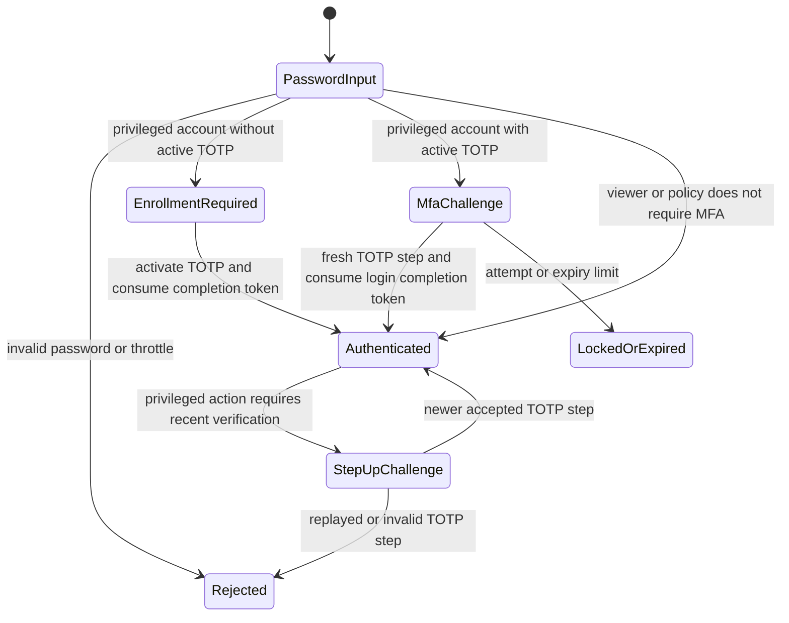
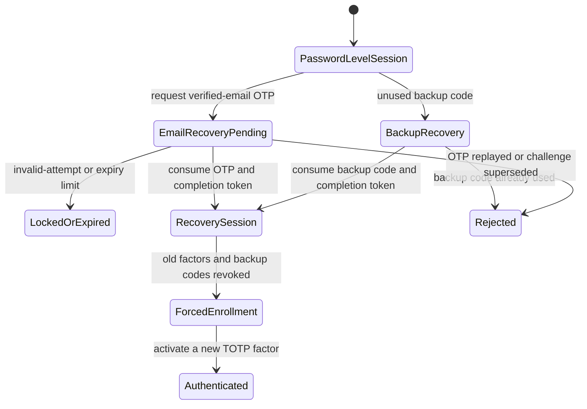
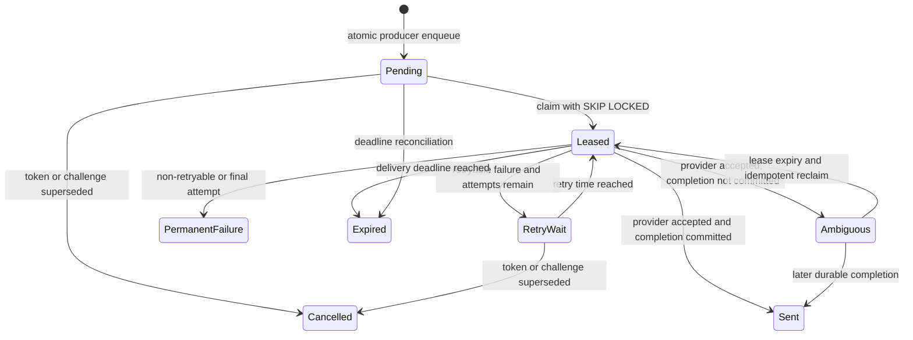

# PR #83 Authentication and Notification Hardening Evidence

This package is the reviewer-facing evidence for CyberTrace V6.1 on draft PR
#83. It describes the implementation through commit
`354f2f91ffcc78c8ccf68fef07998857bdc33853`; the exact pushed head and CI run
are finalized in the living execution record after documentation evidence is
committed.
The living, per-unit command record remains
`docs/project-ops/PR83_EXECUTION_RECORD.md`.

No hosted Supabase project, shared database, production credential, live email
provider, or rollout flag was changed to produce this evidence. All browser and
PostgreSQL proof used disposable local resources and reserved `example.test`
identities.

## Authentication state model

The browser never calls FastAPI or PostgreSQL directly. Authentication requests
terminate at Next.js/Auth.js; server-only database modules use the service role
to invoke purpose-specific PostgreSQL functions. `authz_version` invalidates
older sessions after security-sensitive account changes.



Password verification is bounded by the shared Argon2 concurrency gate and
login throttles. A successful password is not itself proof of MFA. The database
creates a purpose-bound challenge and one-time completion token; Auth.js consumes
that token before establishing final claims. Mixed credential modes are rejected.
Accepted TOTP time steps are stored and cannot be replayed. Challenges and
completion tokens expire; invalid attempts are persisted and lock when their
implemented limit is reached.



Backup-code and email-OTP recovery are intentionally one-time. Both establish a
short-lived recovery-level handoff, revoke superseded MFA material, increment
authorization freshness, and force TOTP re-enrollment before normal privileged
use. The email OTP is HMAC-digested in the challenge table and AES-GCM protected
in the pending notification row; it is decrypted only at delivery or inside the
disposable E2E harness.

Primary evidence:

- `frontend/auth.ts` — password, MFA, and recovery credential-mode selection and
  final session claims.
- `frontend/lib/auth/route-guard.ts` — request-time authorization freshness and
  MFA/recovery route requirements.
- `frontend/lib/server/db/totp.ts`, `mfa-recovery.ts`, and
  `password-recovery.ts` — server-only transition boundaries.
- Migrations `20260710_000011` through `20260711_000017` — factors,
  challenges, completion tokens, attempt accounting, recovery, and recent
  purpose-bound step-up.
- `frontend/e2e/auth-journeys.spec.ts` — five browser journeys and durable state
  assertions.

## Notification lifecycle model

The durable database statuses are `pending`, `leased`, `retry_wait`, `sent`,
`cancelled`, `expired`, and `permanent_failure`. “Provider accepted, database
completion ambiguous” is deliberately a worker outcome, not a new durable row
status: until reconciliation, the row remains leased and can be reclaimed only
after its lease expires.



Every terminal transition scrubs `payload_safe_json` to `{}`. Active
`password_setup`, `password_reset`, `email_verification`, and
`email_recovery_otp` rows must contain an exact version-1 envelope. Next.js
encrypts before the atomic RPC with AES-256-GCM, a random 96-bit nonce, and AAD
binding kind, recipient, and provider idempotency key. The worker fails closed
before the provider when the envelope, version, context, tag, or dedicated key
is invalid.

The worker increments `sent` only after the database completion transition.
Provider acceptance followed by completion failure increments `ambiguous` and
emits `notification.delivery_completion_ambiguous` with event, trace/request,
provider message, idempotency, attempt, state, outcome, error class, and duration
fields. Recipient and payload are never passed to that event. Reconciliation
uses lease expiry plus the same provider idempotency key; it does not perform an
unkeyed immediate resend.

Primary evidence:

- `web_app/notifications/worker.py` and `models.py` — delivery accounting and
  ambiguous result.
- `web_app/notifications/payload_crypto.py` — fail-closed delivery decryption.
- `frontend/lib/server/notifications/payload-crypto-core.ts` — producer-side
  encryption and shared wire contract.
- Migrations `20260710_000009`, `20260711_000016`, and `20260711_000019` —
  claim/complete/fail, deadlines/scrubbing, protected producers, and migration
  gates.
- `tests/unit/notifications/test_worker.py` and
  `test_payload_crypto.py` — redaction, accounting, tamper, and interoperability
  proof.

## Finding traceability matrix

| Finding | Root cause | Fix and primary symbols | Regression/validation | Completion and residual risk |
|---|---|---|---|---|
| F-01 | Static TOTP was reused across journeys despite database replay rejection. | Dynamic TOTP helpers and separate accepted time steps in `frontend/test-support/auth-e2e/totp.ts` and `auth-journeys.spec.ts`. | Managed Playwright: replay fails and a newer step succeeds. | Fixed locally; clock behavior still depends on the runtime clock. |
| F-02 | Browser tests depended on manually supplied identities and recovery values. | `auth-e2e-environment.mjs`, global setup, seed material, database readers, and unconditional cleanup. | `npm run test:e2e:auth`: five disposable journeys pass. | Fixed; Docker and installed Chromium remain test prerequisites. |
| F-03/F-12 | Auth E2E was skipped manually and absent from CI. | Unit 1 created the deterministic command; Unit 6A added the required `auth-e2e` workflow job with managed Chromium and cleanup. | Five local journeys pass; the required remote job passed in 3m37s on `7e5a61c`. | Fixed; Docker/Chromium cold-start time remains an operational CI cost. |
| F-04 | Auth.js credential declarations and mixed completion modes were not proven through the framework/browser. | Explicit credential fields, mutually exclusive mode validation, final session assertions. | Auth integration tests plus five browser journeys. | Fixed. |
| F-05 | Production control flow compared exception text to `NEXT_REDIRECT`. | Auth.js calls use `redirect: false`; clients own final navigation. | Redirect component regressions and browser journeys. | Fixed; framework upgrades still require the normal frontend suite. |
| F-06 | Worker counted provider acceptance as sent before durable completion. | `OutboxWorker.run_once`, `WorkerRunResult.ambiguous`. | Worker success, completion-failure, cancellation, and retry tests. | Fixed; ambiguous delivery remains an operator reconciliation concern. |
| F-07 | Readiness returned healthy when a required worker was unhealthy. | Shared health handler now evaluates database and required-worker state. | Required/optional/disabled worker health tests. | Fixed; the two public paths remain readiness aliases by design. |
| F-08 | PR description and evidence counts were stale. | Living execution record and PR description refreshed from executed commands. | Commit/PR head equality and recorded test output. | Fixed per completed unit; final refresh remains required after Unit 6. |
| F-09 | Example configuration used a personal smoke recipient. | `smoke-recipient@example.test` in `.env.example` and smoke defaults. | Smoke regression plus Gitleaks review. | Fixed. |
| F-10 | Pending outbox rows stored reset/setup/verification URLs and OTPs as plaintext JSON. | AES-GCM modules, five protected RPCs, worker boundary, migration `000019`. | Crypto/producer/worker tests, 105 PostgreSQL integrations, legacy-row gate. | Fixed for new active rows; key rotation requires a planned version window. |
| F-11 | Hosted target, role, key, provider, and smoke identity could not be verified locally. | Approval-gated checklist in `CYBERTRACE_V61_DEPLOYMENT_RUNBOOK.md`. | Local PostgreSQL 17.6 migration and role proof only. | Prepared, externally blocked; no hosted action is claimed. |
| F-13 | Completion ambiguity logged only a generic warning. | Structured `notification.delivery_completion_ambiguous` event. | Log-capture tests require correlation fields and exclude secrets. | Fixed locally; external log routing is deployment-time work. |
| F-14 | Emergency MFA reset used the broad service-role boundary. | Migration `000020`, `cybertrace_break_glass`, one restricted function, and the fail-closed Python operator CLI. | PostgreSQL role/function tests, upgrade/downgrade/re-upgrade, CLI safeguards. | Fixed locally; hosted login membership remains a human approval gate. |
| F-15 | Auth, notification, recovery, migration, and demo instructions overlap and contradict. | Canonical routing table plus explicit historical/background banners and aligned current-state docs. | `tests/unit/test_docs_navigation.py` checks categories, stale claims, and local Markdown links. | Fixed for maintained docs; historical counts remain intentionally preserved behind banners. |

## Reproduction and validation record

The original defects were established from source and targeted red tests:

- the baseline browser project could not create its own data and timed out
  before executing journeys;
- worker tests showed `sent` incrementing before durable completion;
- health tests showed a required unhealthy worker still returned 200;
- outbox migration/source inspection showed plaintext URLs and OTPs;
- the first real PostgreSQL 17.6 `000019` attempt exposed an invalid
  `jsonb_object_length` assumption, then passed after the exact-key expression
  was corrected;
- a deliberate active plaintext row stopped `000019` until the row was
  terminalized, proving the migration does not silently guess.

Final commands executed through Unit 6:

```powershell
# Backend and disposable PostgreSQL
$env:CYBERTRACE_POSTGRES_TEST_URL='postgresql://<disposable-local-url>'
.venv\Scripts\python.exe -m alembic upgrade head
.venv\Scripts\python.exe -m pytest -q tests/integration
.venv\Scripts\python.exe -m pytest -q

# Frontend, using Node 24.18.0
cd frontend
npm run lint
npm run typecheck
npx vitest run --pool=threads
npm run build
npm run test:e2e:auth

# Dependency and secret checks
.venv\Scripts\python.exe -m pip check
.venv\Scripts\python.exe -m pip_audit -r requirements.txt
npm audit --audit-level=high
gitleaks git --staged --redact --config .gitleaks.toml .
```

Observed completed-tree results were: 650 backend tests; 107 PostgreSQL
integration tests within that total; 83 frontend test files and 473 tests;
frontend lint/typecheck; a 39-page production build; and five of five managed
Chromium journeys in 1.8 minutes. Gitleaks 8.24.3 reported no staged leak,
`pip-audit` reported no known vulnerability, and npm reported no high/critical
finding (two moderate transitive PostCSS findings remain without a non-breaking
automatic fix). The in-app Browser separately rendered the production login,
found one email control, one password control, and one enabled sign-in button,
then observed the disabled `Signing in...` transition with synthetic input.

The migration chain reached the single head `20260712_000020` on PostgreSQL
17.6. An active synthetic plaintext reset row produced the documented reviewed-
remediation exception; after terminalization, the same database upgraded to the
head. No trace, video, raw snapshot, password, OTP, reset URL, provider key, or
database credential is retained as evidence.

### Unit commits

| Unit | Commit | Intent |
|---|---|---|
| 0 | `d41c3d3ba0d2bbfcfe3b87659fdd9b8641f7d046` | Freeze final hardening baseline. |
| 1 | `2689813cd98b2881b3715a65d174eba6cd9b93c8` | Add deterministic MFA/recovery E2E harness. |
| 1 follow-up | `8f4c24c7208f3c57868ba5212e4d0cd345ca9906` | Bound the public RFC TOTP vector allowlist. |
| 2 | `c4629c147b21b9c4fd7a2b0e7b80c235a8b346a1` | Fix redirect, accounting, readiness, and ambiguity. |
| 2 evidence | `96ec6dc084d78eb924358c6a6b4c2b6b1a32608e` | Record immutable Unit 2 proof. |
| 3 | `11d5628916f53126bf844f82860e0072a17500aa` | Refresh validation and safe examples. |
| 3 evidence | `9a076885b5669b91ed50d31b9f4e4f98cd182e32` | Record immutable Unit 3 proof. |
| 4 | `01202b4159de8027ec793ca7fcbb47e22e06df33` | Protect secret-bearing outbox payloads. |
| 4 evidence | `c0bf95e33b2f17604de6deef722ce53cb66282d3` | Record immutable Unit 4 proof. |
| 5 | `dbe743babfd5d1c281506cb364e376aca230d4ce` | Add the thesis-grade evidence package. |
| 5 evidence | `ac21541edbbbaa09b13ccba9ef88b1388319d555` | Record immutable Unit 5 proof. |
| 6A | `79ae298a2957abcc7dafe70840b97ac4c59a819a` | Require managed auth Playwright in CI. |
| 6A follow-up | `f8da38ed43d466c90f1e557c73a5532b0f556e6c` | Use the CI setup-Python runtime. |
| 6A follow-up | `9e31333922d780229ba4d8110a0d58a7dc8a2718` | Supply required migration settings. |
| 6C | `7e5a61cc5600abf780cfa0f462388eb6a2baf70a` | Add restricted audited break glass. |
| 6 CI follow-up | `354f2f91ffcc78c8ccf68fef07998857bdc33853` | Mirror Supabase roles in stock PostgreSQL CI and fix the environment fixture. |

## Safe five-journey demonstration

Prerequisites are Docker Desktop, repository Python dependencies, frontend npm
dependencies, installed Playwright Chromium, and Node 24. No static E2E account,
password, TOTP secret, OTP, backup code, Supabase key, or database URL is needed.

```powershell
cd frontend
fnm use 24.18.0
npx playwright install chromium  # one-time workstation setup
npm run test:e2e:auth
```

The command creates uniquely named PostgreSQL 17.6 and PostgREST 14.14
containers on loopback plus a local `/rest/v1` compatibility proxy, applies the
real Alembic chain, generates short-lived keys and five separate identities,
prewarms critical routes, runs these journeys, cleans seeded rows, and removes
the proxy, containers, and network in `finally`:

1. first-time privileged enrollment and assured dashboard session;
2. normal password login plus fresh TOTP completion;
3. one-time backup recovery and forced authenticator re-enrollment;
4. one-time encrypted email-OTP recovery and forced re-enrollment;
5. privileged step-up rejecting replay and accepting a newer TOTP step.

Success is exactly five passed tests plus
`AUTH_E2E: disposable environment removed`. On failure, retain only the HTML
report, fixed redacted context, and masked screenshot. Trace, video, automatic
screenshots, raw page snapshots, browser-console forwarding, and server-action
stdout stay disabled because they can retain authentication material.

## Scope justification and deferred work

- Enterprise orchestration is excluded: this capstone has one Next.js app, one
  FastAPI process boundary, and one hosted PostgreSQL boundary; Kubernetes,
  Terraform, queues, and SIEM deployment do not prove the selected findings.
- Multiple workers are excluded: batch size one plus database leases,
  `SKIP LOCKED`, durable attempts, and provider idempotency prove the lifecycle
  without introducing coordination scale the thesis does not operate.
- Distributed throttling is excluded: the implemented bounded in-process gates
  match the single-process thesis deployment. A shared limiter is deployment-
  scale work, not required to validate authentication correctness.
- External KMS is excluded: the dedicated versioned environment key and
  authenticated envelope prove protection at rest. Managed KMS integration and
  rotation ceremonies require a concrete hosted platform and approval.
- A broad browser matrix is excluded: the dashboard supports one required
  Chromium security project. Adding engines multiplies runtime and flake surface
  without evidence of a browser-specific auth defect.
- Migration squashing is excluded: the additive chain preserves review,
  downgrade, and thesis traceability. Rewriting already-pushed migration history
  would increase deployment risk.
- Unrelated UI refactoring is excluded: changes are limited to auth handoffs,
  deterministic tests, and security boundaries; the existing dashboard design
  and BFF contract remain intact.

Hosted migration, role grants, key creation/rotation, provider configuration,
live delivery, feature enablement, and public deployment remain approval-gated.
The exact preparation and rollback checks are in
`docs/project-ops/CYBERTRACE_V61_DEPLOYMENT_RUNBOOK.md`.
